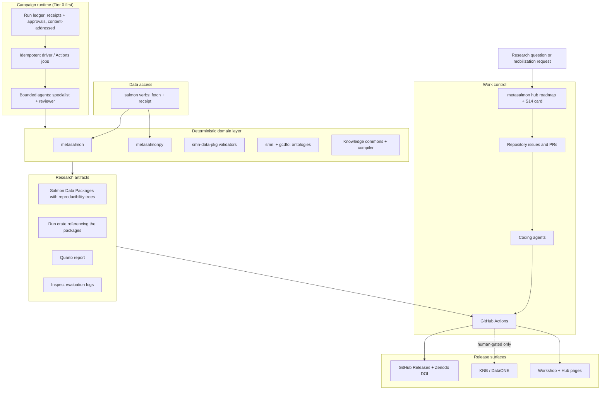

# Salmon Science Foundry

> **Status and authority.** This 2026-09-04 proposal is retained as a design
> and planning input. It is not the bundle's sequencing authority and does not
> activate any task. Adopted work must be reconciled into
> [the roadmap](../roadmap.md), an owning sequence card under
> `knowledge/sequences/`, and any applicable owning repository or external
> planning system. Under the membership test ruled 2026-08-24, sequencing a
> repository's work *is* membership, so nothing in Appendix B is pasted into
> the roadmap until Brett rules the questions in Appendix A.
>
> **Provenance.** Version 1 was imported on 2026-09-04 from Brett's
> `salmon-science-foundry-concrete-plan.md` (owner Brett Johnson; original
> subtitle: *"A concrete, agent-parallelized research and
> application-development plan built on MetaSalmon, the Salmon Domain
> Ontology, the Salmon Knowledge Commons, and the ontology workshop"*; original
> horizon: 12-week v0.1, 6-month program). **Version 2, this file, is the same
> day's review and revision.** It was produced by a nine-dimension agent review
> (166 findings; verification state recorded in Appendix D), a six-lane
> research sweep on data-access tooling, agent tooling, benchmarks,
> orchestration, and ecosystem gaps, and six rulings Brett gave mid-review
> (§0.1). The verbatim v1 text is preserved outside the bundle for diffing;
> the v1 sections that survive are kept in place, and every section that
> changed says so in §0.2.
>
> **Companion design input:** the
> [OKF-centred semantic knowledge architecture](2026-09-04-okf-graphify-semantic-knowledge-workflow.md)
> note (added the same day) is the design basis for §3.8.

## 0. Read this first

### 0.1 Rulings that reshaped the plan (Brett, 2026-09-04)

These were given during the review and supersede v1 wherever they conflict.

| # | Ruling | What it changed |
|---|---|---|
| R1 | The open-source work will be housed in a planned British Columbia not-for-profit research institute (working name at the time; **renamed by R10 on 2026-09-05 to Symecology Institute** — the 2026-09-04 name is not repeated here, because a superseded working name that survives in a public document is a name someone will cite). A GitHub organization and incorporation are likely. | v1's "proposed institute" and "product/research thesis" (§14, §17) had no recorded basis; now they have one, and **where each repository lives** becomes a deliberate decision (§4.1, Appendix A Q26). |
| R2 | The ecosystem is **institute work**: not PSC work, and not the work of Brett's separate commercial consultancy. It is not on the PSC-approved side-project list, and Brett is proceeding as institute work. | No PSC data, code, credentials, or planning surfaces enter the Foundry (§3.12, §5.2). **Amended 2026-09-05 (R7): one bounded exception — the PSC core-model ontology (§7-J).** PSC planning stays in the PSC-DSC Project. |
| R3 | **Fraser Recruits does not exist in the public Foundry for now.** | Workstream F, Study 3, issue #23, and the `campaigns/fraser-recruits/` directory are removed. S13's metasalmon-side requirements stay on the hub roadmap as S13 (§7). |
| R4 | Brett's capacity is **about five hours a week**; agents do more, Brett gates less often. | The twelve-week, seven-lane calendar and the 72-hour kickoff are replaced by a two-stage program with batched gates (§8, §12, §16). |
| R5 | **Preprints early and per stage.** Benchmark questions will be **crowdsourced** later with named collaborators. Brett will work mainly in **Claude Science** and needs an **arXiv** account and endorsement. | §11 and §17 become a preprint sequence; SalmonBench is designed for external task authors (§7-D); tooling and venue facts are recorded (§17). |
| R6 | The OKF/Graphify architecture note joins the bundle and its ideas are to be incorporated. | §3.8 is rewritten around it. |

### 0.1b Rulings of 2026-09-05 (Brett), which reshape it again

| # | Ruling | What it changed |
|---|---|---|
| ~~R7~~ **WITHDRAWN 2026-09-09 (R11)** | **PSC work is in scope, in one bounded form.** Build a **PSC Vocabulary and Ontology**: the ontology is a distillation of the PSC's core model in Domain-Driven Design terms, so that Brett's Domain Data Engineers can relate their Bounded Contexts to it. Its repository is created in the **Pacific-Salmon-Commission** GitHub organization and becomes part of the metasalmon hub. It is interoperable with `smn:` where necessary, but its main goal is a common core understanding of the PSC. | R2's "not PSC work" is **amended, not reversed**: the Foundry stays free of PSC data, code, credentials, and planning, and the PSC ontology is a *separate, PSC-owned* stream (§7-J) that the hub sequences. New workstream J, new §4.6, new Q31 to Q34. |
| ~~R8~~ **WITHDRAWN 2026-09-09 (R11)** | **Fraser Recruits is back in scope** — as the first Bounded Context registered against the PSC core model, not as a public Foundry campaign. | R3 stands for the Foundry (§7-F unchanged). S13's metasalmon requirements stand. The dataset returns in §7-J as a context registration whose artifacts stay in their PSC repository. |
| R9 | **Redesign and simplify hub coordination** so any agent can pick up work that is not currently checked out. The OpenAI Symphony spec is the inspiration; newer approaches are welcome. **Amended by R12**: the GitHub Project is dropped and the queue is git files alone. | §3.1 and §9 are replaced by §9's new coordination design; the bundle's role changes (state leaves, knowledge stays). Measured duplication is in §9.1. |
| R10 | The institute's working name changed on 2026-09-05, and **changed again on 2026-09-09 to Symecology Institute**. The GitHub organization **has not been created yet** under any name. | Every occurrence renamed. `Symecology-Institute` is the *assumed* slug and is unconfirmed. The name has now moved twice in five days, which is the argument for the organization not existing yet: an organization rename releases the old name for anyone to claim, and nothing before Stage A week 3 needs it. |

### 0.1c Rulings of 2026-09-09 (Brett), which withdraw one of them again

| # | Ruling | What it changed |
|---|---|---|
| R11 | **The PSC ontology is out of this hub.** Brett: *"I don't think I want the PSC Ontology as part of this hub anymore … Let's leave PSC out for now."* | **R7 and R8 are withdrawn.** Workstream J is deleted, S16 is withdrawn from the integration kit, and Fraser Recruits returns to out-of-scope. The design work is not lost: it is held as a session memo and can be revived as PSC-side work whenever Brett wants it, under PSC-DSC rather than here. |
| R12 | **No GitHub Project.** Brett: *"Just do the git files, don't bother with the generated GitHub project view if that's only for me."* | §9 loses the Project, the sync program, and the second authorization paragraph. What remains is a git-native queue and a claim that is a `git push`. This is a **simplification**, not a compromise: the Project was the only part of the design that needed a token scope, an unattended credential, or a second representation to keep honest. |
| R13 | **Authorization: paragraph 1 only.** Git pushes to claim refs and agent branches. Paragraph 3 (one draft pull request per handed-back item) is **declined**; paragraph 2 no longer exists under R12. | An agent pushes a branch, prints the compare URL, and stops. Brett opens every pull request, at about thirty seconds each. |
| R14 | **The hub's own bundle migrates to upstream OKF v0.2** (Q34), and the migration makes *more* sense under R11 than it did before. | With no PSC work anywhere in this ecosystem, a public hub validating itself with a PSC-owned tool from a sibling checkout is a dependency with nothing on the other end. |

**What R11 does to the boundary, stated because it is now simpler than it has
been since 2026-09-04.** There is no PSC work in this plan. R2 stands
unamended: no PSC data, code, credentials, or planning surfaces, and now no
PSC repository either. The one PSC-owned thing that remains is
`psc-salmon-vocabularies`, which has been a hub member since before any of
this and which R11 does not mention; it stays, and if Brett wants it
reconsidered that is a separate ruling, not an implication of this one.


### 0.2 Change record

Every section below is either kept from v1 (marked **kept**), corrected in
place (**corrected**, with the finding ids from Appendix D), or replaced
(**replaced**, with the ruling or findings that drove it).

| Section | Change | Driven by |
|---|---|---|
| Executive decision | corrected: thesis kept; eight 12-week deliverables replaced by two staged outcomes | R4, feas-1, feas-5, strategy-1 |
| 1.1 asset map | corrected: five rows fixed, four rows added (`dfo-salmon-ontology`, `psc-salmon-vocabularies`, `smn-sci-plgn`, `smn-data-gpt`) | currency-1, -3, -10, -11, -12, -13; agent-tooling lane |
| 1.2 seeds | corrected: PR #27, issue #6, S12/S13/S1 state, #90/#95/#116 | currency-2, -7, -8, -14, -17; hub-4; architecture-8; rd-16 |
| 1.3 boundary | kept, plus the S7 amendment as a hub item | hub-20, architecture-7 |
| 1.4 users and demand | **new** | ecosystem-gaps G4; strategy-4 |
| 2 | corrected: one diagram, four kinds of orchestration become three, Temporal leaves the default path | architecture-3, orchestration lane |
| 3.1 | replaced: no organization-level Project with ten fields; hub roadmap plus repository issues; institute organization | hub-11, strategy-12, governance-2 |
| 3.2 | kept, shorter; identity rule added | governance-2, governance-3 |
| 3.3 | replaced: tiered durable substrate with entry triggers; Temporal is Tier 2 | architecture-3, orchestration lane, ext-6 |
| 3.4 | corrected: PydanticAI only from the ontology-grounded conditions; `TemporalDurability` not `TemporalAgent` | ext-4, architecture-15 |
| 3.5 | replaced: tool contracts reuse the receipt schemas that already exist; **data-access layer** and delivery shape added | architecture-2, -5, -11; gget, bio-eco, agent-tooling lanes |
| 3.6 | corrected: access-class and redistribution enumerations; dataset authority table | governance-7, -8; bio-eco lane |
| 3.7 | replaced: a run is an SDP reproducibility tree plus a crate that references it | architecture-2, -4; orchestration lane |
| 3.8 | replaced: the OKF-centred semantic knowledge compiler; what already exists | R6; hub-14; currency-4, -5 |
| 3.9, 3.10, 3.11 | corrected: `targets` default; Inspect wording; Langfuse deferred | orchestration lane, ext-3, architecture-14 |
| 3.12 | corrected: identity rule; attestation caveat; no PSC credentials | governance-2, -3; ext-2 |
| 4.1 | replaced: institute organization and repository homes as a decision table | R1; hub-2; Q26 |
| 4.2 | replaced: the hub's actual integration procedure | hub-7, -9; integration-readiness |
| 4.3, 4.4, 4.5 | corrected and trimmed | ext-7, orchestration lane |
| 5 | kept; state machine trimmed; approvals binding kept; named authorities required | architecture-1, governance-11 |
| 6 | kept; start with one specialist and one reviewer | rd-1, strategy-9 |
| 7-A, 7-B | corrected: owners are S5/S1/S12; items 2, 6, 7, 11, 12 fixed | currency-2, -7, -8, -16; hub-5 |
| 7-C | replaced: Tier 0 runtime | architecture-3 |
| 7-D | replaced: benchmark redesigned for validity and external authors | rd-1 to rd-7, rd-12; benchmarks lane; R5 |
| 7-E | corrected: evidence into Q6, not adjudication; no public commons feed without a ruling | hub-4, hub-14, governance-6 |
| 7-F | **removed** | R3; hub-1; governance-1; strategy-3 |
| 7-G | corrected: after S4; Excel review workbook is the on-ramp, not a UI | ecosystem-gaps G4, G12 |
| 7-H data access, 7-I citation and governance | **new** | gget, bio-eco, ecosystem-gaps lanes |
| 8 | replaced: two stages at five hours a week | R4; feasibility drafts |
| 9 | replaced: work control in two sentences | hub-11 |
| 10 | replaced: fewer issues, drafted for Brett to post | governance-2; hub-10 |
| 11 | replaced: protocol preprint then results; PR #27 as a case study; Study 3 removed | rd-1, rd-2, rd-3, rd-8, rd-10; R3 |
| 12 | replaced: one weekly gate session | R4 |
| 13 | corrected: retirement conditions on every "not yet" | AGENTS.md guard rule; ecosystem-gaps G12 |
| 14 | replaced: institute framing with a decision, funder table | R1; ecosystem-gaps G7 |
| 15 | corrected: entry triggers move to §3 | architecture-17 |
| 16 | replaced: first two weeks | R4 |
| 17 | replaced: preprint sequence, venues, endorsement | R5; rd-10, rd-14; ecosystem-gaps G11 |
| 18 | replaced: dated and verified | ext-10 |
| Appendix A–D | **new**; Appendix B is a pointer to the [integration kit](2026-09-04-s14-hub-integration-kit.md) card | integration-readiness; hub-rules |

**Second pass, 2026-09-05.**

| Section | Change | Driven by |
|---|---|---|
| 0.1b | **new**: the four rulings of 2026-09-05 | R7–R10 |
| 1.1, 4.1 | corrected: institute renamed; organization does not exist; two repositories move, not four | R10, Q26, Q35 |
| 3.1, 9 | **replaced**: hub coordination redesigned with a claim protocol any agent can run (the Project it originally used was removed on 2026-09-09) | R9; the hub audit's measured duplication |
| 4.4, footnote, Q21 | corrected: every commercial product and company name removed from this public bundle; a machine-level guard installed instead | Q21 |
| 7-J | **new**: the PSC core-model ontology, as PSC work the hub sequences | R7, R8 |
| 13 | corrected: the "no organization-level Project" row retires, and says why its own trigger was the wrong one | R9 |
| Appendix A | **replaced**: Q19–Q30 recorded as ruled; Q31–Q35 opened | Brett's rulings |
| Appendix E | **new**: what the 2026-09-05 research established, overturned, and still cannot verify | this pass |

**Third pass, 2026-09-09.**

| Section | Change | Driven by |
|---|---|---|
| 0.1c | **new**: the four rulings of 2026-09-09 | R11–R14 |
| 7-J | **withdrawn**: the PSC core-model ontology leaves the plan; what is worth carrying forward is kept in a short note | R11 |
| 9 | **simplified**: the GitHub Project, its sync program, its credential, and its authorization paragraph are all removed; the queue is git files alone | R12, R13 |
| 9.7 | migration drops from about 26 agent-hours to about 18, and step 1 from an hour to ten minutes | R12 |
| 16, 8.2 | Day 1 shrinks to three errands; the institute organization is deferred to week 3 | Q35 |
| Appendix A | **closed**: Q31 to Q37 ruled or withdrawn; no open questions remain in this plan | Brett's rulings |
| 9 (again) | **replaced a second time**: a judged panel of three independent coordination designs reached a better answer than the first draft, and §9.8 states where it departs from the ruling | the design panel, 2026-09-05 |
| 7-J (again) | strengthened by the ontology panel on 2026-09-05, then **withdrawn entirely on 2026-09-09** | the ontology panel; then R11 |

### 0.3 The verdict, in one paragraph

The thesis is worth testing and the plan's guardrails (rights gate, no model
approves a gate, exact-digest approvals, "what not to build") are the parts
that already sound like the ecosystem's rules. What did not survive review is
the shape: a runtime-first, twelve-week, seven-lane program that spends its
first month on Temporal, PydanticAI, RO-Crate, Langfuse, and pyoxigraph before
any measurement exists, at ten to fifteen of Brett's hours a week that he
does not have. The revised program does the work the hub already owes (the
gold standard, the Python port, one validation authority, one test deposit),
adds the two things the ecosystem lacks and nobody else will build (a
deterministic salmon data-access layer and a domain benchmark that scores
data-package construction, governed semantic mapping, and provenance
closure), and treats every piece of infrastructure as something a measured
condition switches on. Each stage ends in a small preprint.

### 0.4 The verdict after the second pass (2026-09-05)

The programme above is unchanged in substance. Two things were added around
it, and one of them changes the order of the first month.

**The coordination change comes first, and it is not a detour.** Brett is
right that the bundle duplicates itself: 25% of it is planning state,
restated three to seventeen times, with five copies stale on the day they
were counted. That tax is paid by every stream, including this one, and S14's
own paste would have added eleven more copies of a number. So S15 (§9) goes
ahead of the pastes. What it must not become is a project in its own right,
and after three passes it is not: a queue of small files, a claim that is a
`git push`, one policy file, and one small script, with a measured queue of
about 34 claimable items behind it and an explicit point of no return. Each
pass made it smaller.

**The PSC core-model ontology came in on 2026-09-05 and went out on
2026-09-09**, and the plan is better for both moves. It was worth designing:
the research established that three PSC semantic artifacts exist with nothing
saying how they relate, and that the missing context map is the deliverable
that would pay for such a repository. It was also the only thing in this plan
that put a PSC-owned repository inside a hub whose ruled membership test could
not admit it, and the tension that produced showed up immediately as a
question nobody could answer cleanly. Withdrawing it restores R2 in its
original form and removes that question rather than adjudicating it.

**No decisions are outstanding.** Q19 to Q30 were ruled 2026-09-05 and Q31 to
Q37 ruled or withdrawn 2026-09-09; Appendix A holds them all. §2 to §6 are reference material, not for ruling.

---

## Executive decision

The right next move is **not** to build another salmon chatbot, a generic
multi-agent swarm, or a replacement for metasalmon. (kept)

Build a thin orchestration, data-access, and evaluation layer, the **Salmon
Science Foundry**, above the assets that already exist:

- **metasalmon and metasalmonpy** remain the executable domain layer for
  creating, reviewing, validating, migrating, and publishing Salmon Data
  Packages (SDPs).
- **`smn-data-pkg`** remains the normative SDP specification.
- **The Salmon Domain Ontology (`smn:`) and the GC DFO Salmon Ontology
  (`gcdfo:`)** remain the governed semantic layers; v1 omitted `gcdfo:`
  entirely, and it is the ontology every gold-standard `AREA` value resolves
  against.
- **The Salmon Knowledge Commons** remains the evidence-backed source of
  domain claims, definitions, uncertainty, and semantic gaps.
- **The salmon data standards workshop** is the human acceptance surface and
  the place the stated audience (Excel-first biologists and R analysts) meets
  the tooling.
- **The Foundry** coordinates campaigns, holds the run ledger and receipts,
  and ships the data-access verbs. **SalmonBench is its own institute
  repository from the start** (Q26), rather than living in `bench/` until
  extraction criteria are met.
- **The hub itself** is being simplified in parallel (§9): planning state
  moves to a git-native queue so that any agent can pick up unclaimed work,
  and the bundle keeps what a tracker cannot hold.
- **No PSC work.** A PSC core-model ontology was in scope from 2026-09-05 to
  2026-09-09 and is withdrawn (R11), which restores R2 in its original form.

The research thesis (kept):

> **Executable domain semantics, deterministic scientific tools, and explicit
> human gates materially improve the reliability, reproducibility, and
> transferability of scientific agents.**

The review sharpened what is new about it. The tool half is a replication:
deterministic tools beating file-only agents is already shown for genomics
(gget virus and VirBench, arXiv:2606.06749) and for curation (SPIRES,
Biomni). The contribution here is the **semantics half**: a governed domain
ontology plus source-backed evidence, measured against deterministic tools
alone, on tasks (data-package construction, mapping against a governed
ontology with explicit gaps, provenance closure) that no existing benchmark
scores. §11 is written around that contrast.

**What the first stage produces** (replacing v1's eight deliverables in
twelve weeks; §8 has the schedule):

1. a validator-clean Fraser coho gold-standard SDP (S12 stage 1), with the
   S12 execplan written;
2. metasalmonpy parity with metasalmon 0.5.0 (the port S5 owes);
3. the S1 conformance test, so "passes both validators" means one thing;
4. a `salmon` data-access verb family over the first open sources, each call
   returning a receipt, feeding `create_sdp()`;
5. a 25-task SalmonBench pilot with deterministic scorers and a
   preregistered protocol preprint;
6. one end-to-end KNB test-node deposit (needs Brett's dev.nceas token).

**What the second stage produces, if the first stage's gate is passed:** the
60-task SalmonBench v0.1 with held-out keys and external task authors, the
results preprint, the PR #27 evidence briefing for Q6, the commons compiler,
the workshop practicum, and only then whatever durable runtime the measured
runs actually needed.

This is feasible at five hours a week because the difficult domain
infrastructure exists and the agents do the rest; it is not feasible at any
hours if the runtime comes first.

---

# 1. What is already built

This plan is based on the state of the repositories on 2026-09-04, checked
against local checkouts and GitHub rather than remembered. Where v1 was
stale, the row says so.

## 1.1 Current asset map (corrected)

| Repository | Current role and evidence (2026-09-04) | Foundry role | Immediate move |
|---|---|---|---|
| [`metasalmon`](https://github.com/salmon-data-mobilization/metasalmon) | R reference implementation, **0.5.0** (2026-08-25). Creates and validates SDPs, deterministic semantic retrieval, opt-in LLM review, the S5 R-native review flow, provenance (a closed reproducibility manifest, a KNB plan manifest with `plan_sha256` and a status ladder, a vocabulary-snapshot digest, `rights_authorization` in EML export), EML, KNB publication with a test-node environment, term requests, observation structures; carries the hub bundle. | Normative R domain toolkit; one of two authoritative SDP implementations. | Not the multi-agent runtime. Write the S12 and S1 execplans; fix #95; land the #90 spec change in `smn-data-pkg`; export the S13 internals or document replacements. |
| [`metasalmonpy`](https://github.com/salmon-data-mobilization/metasalmonpy) | Python mirror, **0.4.0** (2026-08-24). Has creation, retrieval, validation, EML/KNB, `knb_environment`, the parity machinery. Has **none** of the nine 0.5.0 review-and-edit functions, no `decision_reason`, no `constraints.required` consumer; #118 present at `semantics.py:1294`; no port branch exists. Its `AGENTS.md` still reads 0.4.0/0.4.0. | Native Python adapter for the Foundry; second implementation for cross-language conformance. | Close the `0.4.0→0.5.0` window before any new shared surface (owned by S5). Correct its `AGENTS.md` in the same train. |
| [`smn-data-pkg`](https://github.com/salmon-data-mobilization/smn-data-pkg) | Normative SDP schemas, profile v0.3, field reference, observation structures, I-ADOPT guidance, and `scripts/validate_package.py`. CI and a green 23-test suite since PR #6 (2026-08-21, remote `main` 47f0e81; backlog #103 closed — the local checkout used earlier in this review lagged at 1ec6cf5 and misreported this); no LICENSE; Q3/#90 ruled 2026-08-24 but not implemented. | Canonical package contract. | Implement the ruled descriptor allowlist from `column_dictionary.schema.json`; add a licence before the Foundry pins it. |
| [`salmon-domain-ontology`](https://github.com/salmon-data-mobilization/salmon-domain-ontology) | Shared `smn:` ontology; newest tag **0.0.3** (a GitHub pre-release, 2026-08-14; no non-pre-release tag exists); `main` d45f8f7 (2026-08-21) ahead of tag. PR #27 is an open **draft**, mergeable, reworked 2026-08-25 on rulings Q6-1 to Q6-5; still open are Q6-6 (naming), Q6-7 (layer), Q6-8 (sockeye-type peerhood) and the altLabel question; the 2026-09-02 source pass found two attributions failing the passage check. | Governed shared semantics pinned by every run. | Use PR #27 as an evidence-briefing case for Q6, not as a frozen benchmark, until the rulings exist to score against. |
| [`dfo-salmon-ontology`](https://github.com/dfo-pacific-science/dfo-salmon-ontology) (org `dfo-pacific-science`) **— added; v1 omitted it** | GC DFO `gcdfo:` ontology, tag **0.0.9**; `main` 26d7c38 (2026-08-26) ahead of tag with PR #86 (48 PFMAs) and **PR #88 (all 604 PFMA subareas, `gcdfo:PacificFisheryManagementSubareaScheme`)** unreleased; term-review holds #84/#85 open. | The ontology the gold standard's `AREA` column resolves against; the hub's carve-out ruling (Q5) applies. | Pin `main` at or after 26d7c38, or the next tag, and record which. The "PFMA subarea gap" v1 routed through the gap flow is **closed**. |
| `psc-salmon-vocabularies` (PSC GitLab) **— added; v1 omitted it** | SKOS-only, CSV-authoritative PSC controlled vocabulary; v0.1.0-alpha.3 merged, untagged; fully de-prioritised by ruling Q5 (the gold-standard carve-out is gcdfo's). | PSC-owned. **Outside the Foundry** under R2. | None. Recorded so the boundary is visible, not as a dependency. |
| [`salmon-knowledge-commons`](https://github.com/salmon-data-mobilization/salmon-knowledge-commons) | Private upstream-OKF v0.2 bundle; 26 cards (24 Concept, 2 Reference) plus an index, all `draft`, **0 verified** (the only `verified:` line in the repository is the example in its `AGENTS.md`), 64 gaps (54 `open`, 10 `proposed`), 250 citations (recounted 2026-09-04); gap state machine enforced by schema; no versioning scheme (pin by commit). Its `scripts/okf-check.py --gaps` JSON is intended for metasalmon's term-request pipeline, but nothing in metasalmon reads it (0 hits in `R/`, `tests/`, `inst/`, 2026-09-04), so v1's "gap register consumed by MetaSalmon" is a design intent, not a fact. | Evidence substrate for grounding, claim review, gap detection. | Build the compiler (§3.8) privately. **No public "stable subset" exists to publish** until a card is human-verified; that publication is a ruling (Appendix A). |
| [`salmon-data-standards-workshop`](https://github.com/salmon-data-mobilization/salmon-data-standards-workshop) | Carpentries-style lesson; PRs #5 and #6 **merged 2026-08-26**: pinned `metasalmon@v0.5.0` and metasalmonpy `v0.4.0`, `primary_key` now taught, CI green; last commit 2026-08-26 "Broaden workshop FAIR and stewardship goals". Audience: operational biologists who mostly work in Excel, plus R analysts. | Human acceptance surface; the audience. | Finish S4 (needs the S3 deposit). The practicum comes after. |
| [`salmon-ontology-hub`](https://github.com/salmon-data-mobilization/salmon-ontology-hub) | Astro 5 / Starlight 0.37 site; five pages; governance page is a placeholder; **dormant since 2026-02-11**; not a hub member. No site page or README states an RDA working-group role; the repo does track the group's statement of work and meeting notes under `docs/context/` (2026-02-11), and that statement names GitHub, Zenodo, Discord, and the workshop as its channels, not this site. | Candidate public portal. | Only when a released artifact exists to link. Not sequenced by the hub (Appendix A Q20). |
| [`sdp-example-data`](https://github.com/salmon-data-mobilization/sdp-example-data) | Two **synthetic** CSVs (259 B and 157 B), CC0-1.0, one commit, tag v0.1.0 with no GitHub Release, for the GitHub-access guides (referenced only by metasalmonpy's `guides/github-access.qmd`): "Nothing here is a real observation." v1 described it as escapement data and proposed promoting the gold standard into it. | None. | Leave as is. The gold standard's location is **ruled** (Q4: metasalmon `inst/extdata`); the Foundry references it by checksum, never copies it. |
| `smn-sci-plgn` (`Br-Johnson`, public, MIT, 0.0.1, last push 2026-04-18) **— added; v1 omitted it** | Brett's Salmon Data Science Plugin: dual Codex-plugin and Claude-skills scaffold with 14 skills (router, entity normalizer, smn/gcdfo lookup, a thin metasalmon execution skill, StreamNet/PTAGIS/RMIS/DART/NPAFC/NOAA SPS/CRITFC source scaffolds, a stock-brief workflow), a platform registry with access tiers, an identity-record schema, and a gap register that rates the identity graph and behavioral tests P0. Points at the retired `dfo-pacific-science/metasalmon` fork and metasalmon 0.1.2. | The **agent-facing front door** over the packages and the data-access verbs (§3.5). | Repoint it at `salmon-data-mobilization/metasalmon` 0.5.0; fold its platform cards into the data-access source registry; retire its own ontology-lookup scripts once metasalmonpy has parity. Its home is a decision (§4.1). |
| `smn-data-gpt` (private, last 2026-03-19) **— added; v1 omitted it** | Custom-GPT prompt and skill packs for drafting SDPs and an SPSR assessment workspace; its README says the GPT cannot reach sibling repositories or APIs. | Superseded for SDP drafting by metasalmon 0.5.0's review flow. | Archive the drafting packs; keep only what the SPSR workspace still needs (a separate, billable concern). |
| `knowledge_graph_schema` (public, 2025-04-03) | A December 2020 three-file neo4r connection stub. | Historical only. | Archive. Nothing to extract. |
| `LSF-KNB-Integration` (private, 2021) | Four-file R/Shiny snippets against production KNB with a token-like value committed in `app.R` (reported expired; treat as live until rotated). | Historical only. | Include in the credential audit; archive. |
| `shiny-graph` (private, 2021) | visNetwork Shiny prototype with dummy node and relationship files and a **tracked `secrets.R`** (one commit, 2021-01-12; contents not inspected by this review). | None. | Brett audits and rotates anything in `secrets.R` (human-only), then archives. |

## 1.2 Existing work that should directly seed the Foundry (corrected)

- [S5](../sequences/s5-review-flow.md) provides the scriptable semantic and
  metadata decisions; the pasted call is the audit trail. **Its Python port
  is owed and unstarted** (measured 2026-09-04).
- [S7](../sequences/s7-architecture.md) proposes curation sessions and
  information-gain-ranked questions; none of `start_curation_session()` and
  its siblings exists in `R/` yet, so §1.3's boundary amends a design, not
  code.
- [S12](../sequences/s12-fraser-coho-gold-standard.md) rules the 173-row
  `nuseds-fraser-coho-2023-2024.csv` (14 columns) the gold standard and
  records why it is not yet a package: no canonical metadata of its own, 22 of
  27 spec-validator errors from the `codes.csv`/`column_role` contradiction
  (#95), the descriptor allowlist (#90, ruled, unimplemented), and the two
  ontology gaps, **one of which (PFMA subareas) closed on 2026-08-26**. The
  species question is ruled (Q6-1: a literal plus a WoRMS identifier; nothing
  minted). **The S12 execplan is unwritten.** Q9 (which IRI is the property
  and which the variable for a spawner count) is open and the seeder writes
  one IRI into both slots.
- [S13](../sequences/s13-fraser-recruits-case-study.md) documents what
  metasalmon owes its one production consumer: eight `:::` internals to
  export or replace, a migration path off 0.1.8/sdp-0.2.0, bounded IRI
  dereference. Those three are metasalmon work and stay on the roadmap.
  Everything else about that consumer is PSC's (R3). Q13 (the stuck series
  head; a support request only Brett can send) is open. **The S13 execplan is
  unwritten.**
- [S1](../sequences/s1-validation-authority.md) can start now that #90 is
  ruled: zero of the 14 rule ids in `sdp.rules.yaml` appear in `R/`, and the
  two validators return 0 and 27 findings on the same bytes. **The S1
  execplan is unwritten.**
- [S3](../sequences/s3-knb-staging.md): the environment question is **ruled**
  (Q1, 2026-08-22: distinct DataONE test node, live). What remains is Brett's
  dev.nceas token and one end-to-end test deposit. v1's "S3's environment
  question" precondition is discharged; the token and the deposit are the
  real gate.
- [Issue #6](https://github.com/salmon-data-mobilization/metasalmon/issues/6)
  is the **unfinished** Theme A exact-model live cohort (OpenRouter
  `openai/gpt-5.4-mini`; first attempt HTTP 401; three captures owed since
  2026-07-29), on top of `benchmark_term_ranking_fixtures()` and
  `scripts/theme-a-benchmark.R`, which are already a frozen-fixture retrieval
  benchmark with required, allowed, and forbidden oracles. SalmonBench wraps
  those first.
- The **2026-09-02 source pass** (four commons cards; its citation ledger was
  named in three documents and never written, measured 2026-09-10)
  is the evidence base for PR #27 and the gcdfo holds #84/#85; Workstream E
  builds on it rather than restarting.
- The KNB rehearsal script `scripts/build-fraser-coho-knb-rehearsal.R`
  already produces the dry-run plan v1's Workstream B item 11 asked for; the
  real blocker is backlog #116 (an exported producer for the two semantic
  sidecars).

## 1.3 The key architectural boundary (kept, with one hub item)

Amend the S7 design before implementing it:

- **metasalmon owns package-local curation state and deterministic domain
  behaviour.**
- **The Foundry owns multi-stage, multi-agent, cross-repository, long-running
  research workflows.**

Concretely: `start_curation_session()`, `propose_curation_patch()`, and
`approve_curation_patch()` may remain metasalmon functions if they operate on
one package and produce replayable artifacts; model conversations, agent
routing, retries, cross-dataset fan-out, human approval waits, and
campaign-level state belong in the Foundry; metasalmon never needs a workflow
server, an agent framework, or a durable-execution library as an R
dependency; the Foundry calls metasalmon and metasalmonpy through narrow,
versioned tool contracts rather than reimplementing their scientific logic.

**Hub item:** the S7 card says nothing depends on it. S14 does, through this
amendment; the S7 card records that when S14 is ruled (Appendix B).

## 1.4 Users and demand (new)

v1 had zero occurrences of "biologist", "Excel", or "spreadsheet" and two of
"user". The people this ecosystem serves are known and recorded:

| Persona | Evidence | What they can use in the first stage |
|---|---|---|
| Agency biologist working in Excel | Workshop README audience; needs recorded at the RDA Salmon Ontology working group's co-chair meeting of 2026-06-16 (Salmon Prize intake should arrive as source-preserving SDPs; an Excel on-ramp beside R; source-context elicitation before ontology placement), which are meeting notes, not a working-group resolution | The gold-standard package as a copyable example; the multi-sheet Excel review workbook (§7-G); the elicitation template |
| R analyst | Workshop's R-led lanes; the S5 review flow; R in roughly two thirds of recent ecology papers (ecosystem-gaps lane) | `salmon` data-access verbs that return tidy tables plus receipts and feed `create_sdp()`; the S5 review flow |
| Data steward or ontology curator | S9, the commons, PR #27, the gcdfo holds | Source-backed evidence briefings; gap records that become term requests |
| Agent developer (the AI-for-science reader) | The benchmark literature (§11) | SalmonBench tasks and scorers; the skills front door |

Runtime milestones are conditional on the first two rows getting something
usable first. The benchmark is a by-product of real curation work, not the
other way round.

---

# 2. Target architecture (corrected)

## 2.1 System view



## 2.2 Three kinds of orchestration, not four (corrected)

| Job | Tool | Responsibility |
|---|---|---|
| Portfolio and sequencing | The **hub roadmap and S14 card**, plus **repository issues** | What exists, what blocks what, who or what is delegated. One planning surface for this ecosystem; the PSC-DSC Project is PSC's and never carries Foundry items (R2). |
| Coding-agent work | GitHub issue delegation to whichever agents are available | Implement one bounded issue in one repository, run tests, open a PR, respond to review. |
| Campaign execution and evaluation | A **run ledger** (Tier 0), **Inspect AI** for evaluation, a durable-execution library only when a trigger fires (§3.3) | Receipts, digest-bound approvals, resumable re-runs, repeated trials, scoring. |

v1's fourth kind, "agent behaviour and typed tool use" via PydanticAI, is
not orchestration; it is one implementation choice inside the runtime,
entered only from the ontology-grounded benchmark conditions (§3.4).

---

# 3. Concrete technology decisions (rewritten as tiers)

The rule for this section, applied to every choice: **the simplest thing that
satisfies the contract runs first, and each heavier thing names the observed
condition that switches it on.** That condition is written as the retirement
condition of the lighter thing, as `AGENTS.md` requires of any guard.

## 3.1 Work control (superseded 2026-09-05 by §9)

v2 said: hub roadmap plus repository issues, and **no organization-level
Project**. Brett ruled the opposite on 2026-09-05 (R9), so the design is
[§9](#9-hub-coordination-replaced-2026-09-05--r9) and this section keeps only
what survived the ruling:

- One planning surface per ecosystem, still. The Project replaces the
  bundle's status prose; it does not sit beside it.
- Nothing is created in the PSC organization by this plan, and no hub
  automation writes to the PSC-DSC Project (R2, and §7-J for the one PSC
  stream the hub sequences).
- Linear is not used (Brett tried it and did not like it; `tools-and-systems`
  2026-05-21).
- The organization question is unchanged: `salmon-data-mobilization` today,
  because the institute organization does not exist (Q35).

## 3.2 Coding agents (kept, shorter; identity rule added)

Route by task type, not vendor. Role profiles (kept from v1): `r-sdp-maintainer`,
`python-parity-engineer`, `spec-conformance-engineer`,
`ontology-evidence-auditor`, `benchmark-engineer`, `documentation-integrator`,
`skeptical-reviewer`; each inherits the nearest `AGENTS.md`, and the
prohibitions in v1's table stand (no minting, no production publication, no
editing hidden answer keys after seeing results, no reviewer editing what it
grades).

The **agent-ready definition** (v1's ten items) stands. Two additions:

- **Identity rule.** Every automated issue, comment, PR, or status update is
  authored by a dedicated GitHub App identity with `issues:write` and
  `pull_requests:write` on the allowlisted repositories only. No unattended
  job, worker, or cloud agent holds Brett's account credentials, a personal
  access token, or any token issued to his account. An interactive session
  running under Brett's own `gh` authentication may read freely and may
  write (issue, comment, PR, review) only with per-action permission on a
  draft and the target URL, per his global rule; text that appears under his
  name is text he approved. `submit_term_request_issues()` is never called with
  `dry_run = FALSE` from an automated activity. This is Brett's standing rule
  in his global agent instructions, restated where the plan would otherwise
  break it (v1 §9.4 and §12 automated issue creation and status comments).
- **GitHub's third-party coding agents are in public preview and require a
  paid Copilot plan**; Claude Code and Codex are supported. Preview features
  are not a dependency of any campaign (verified 2026-09-04, §18).

## 3.3 Durable substrate, tiered (replaced)

What must be durable is a contract, not a server: **resume after
interruption, approvals bound to exact digests, no large payloads inside the
engine.** Three tiers satisfy it at increasing cost.

| Tier | What it is | Satisfies | Enter when (observed, logged) |
|---|---|---|---|
| **0 — ledger and receipts** (v0.1) | A content-addressed artifact store (`sha256/<aa>/<digest>`), an append-only `provenance/tool-receipts/` and `approvals.jsonl` inside each SDP's `reproducibility/` tree (§3.7), and an idempotent driver that skips any step whose receipt exists (the `targets`/Nextflow model: hash of inputs, command, and dependencies). Human gates are approval lines naming the digest, or GitHub environment approvals bound to the run for finite CI stages. | Resume is "run it again"; the approval *is* the ledger line; there is no engine to hold payloads. | Day one. |
| **1 — in-process durable execution** | [DBOS](https://docs.dbos.dev/) via PydanticAI's `DBOSDurability`: a library, SQLite by default, Postgres later; durable sleep for days; workflow id as idempotency key; small inputs and outputs only. | Automatic retries, durable timers, crash recovery of multi-step agent runs, without a server. | A campaign stage needs per-call retry state against an external system that has no idempotency record of its own, **or** an agent run must survive a process crash mid-run more than once a week. |
| **2 — Temporal** | Temporal server (Compose plus Postgres, or Cloud) with `TemporalDurability` (not `TemporalAgent`, deprecated and removed in PydanticAI v3). | Central history and UI across machines, activity fan-out, in-flight runs surviving workflow-code changes. | A second worker machine or second operator needs shared history and a UI; activity fan-out across machines; or a stage exceeds GitHub Actions' envelope (job limits; 30-day environment-approval wait; 35-day run limit including waits). |

Facts that made v1's Temporal-first plan untestable as written: `temporal
server start-dev` is **in-memory unless `--db-filename` is given**, so the
"resume after worker restart" demo would not survive a server restart;
payloads cap at 2 MB, gRPC at 4 MB, histories at 51,200 events; PydanticAI
copies `deps`, `metadata`, and `model_settings` into history on every
activity, so `deps` may carry only URIs, media types, sizes, and digests;
agent and toolset names are frozen identifiers once a run exists. All of
this transfers unchanged to Tier 2 when it is entered, because the
tool-call-to-receipt interface is the same at every tier.

**GitHub Actions envelope (Tier 0 rule):** finite checks and stages only;
an environment approval is bound to the run and commit, not to an artifact
digest, so it never substitutes for a ledger approval. Keep the activity-shaped
interface so migration to Tier 1 or 2 is mechanical.

**Critical implementation rule (kept):** engine histories are never the
scientific provenance record. Every consequential activity returns a
versioned receipt that enters the run's reproducibility tree.

## 3.4 Agent framework (corrected)

PydanticAI for bounded reasoning activities, for the reasons v1 gave (typed
dependencies, structured outputs, validated tools, provider neutrality, tool
approval, durable-execution integrations for DBOS and Temporal, MCP client).
Two corrections:

- It enters only with the ontology-grounded benchmark conditions (§7-D, O and
  OV); the file-only and tools-only baselines do not need it.
- Model policy (kept): `models.yml` with pinned ids; never `latest` in a
  released run; record resolved provider, exact model id, settings, prompt
  digest, toolset version, usage; a model never scores its own output. One
  pinned model per role in the **confirmatory** run; model-family variation
  is a separate, later study (§11). Preserve issue #6's exact pairing as a
  regression case once the three captures exist.
- **Provider data policy.** Only endpoints with contractual no-training
  terms: Anthropic's commercial terms (which cover the API and Team and
  Enterprise seats; Claude Science also runs on Pro and Max, where consumer
  terms apply and training is on unless the account's opt-out is set, so the
  plan records which plan each seat is on and verifies the opt-out for any
  Pro or Max seat); the OpenAI API default; Google's paid tier; and OpenRouter only with its no-training
  provider routing and the resolved upstream provider recorded in
  `provenance/model-calls.jsonl`. Every run carries a `data_classification`
  (public or restricted); restricted inputs never leave their boundary, and
  "local model failed" never silently means "send it to another provider".

## 3.5 Tool contracts, the data-access layer, and delivery shape (replaced)

### Tool contracts reuse what exists

The Foundry calls the packages through JSON-in / JSON-out command tools:

```text
salmon-foundry tool metasalmon create-sdp request.json
salmon-foundry tool metasalmon validate-sdp request.json
salmon-foundry tool metasalmon review-queue request.json
salmon-foundry tool metasalmonpy create-sdp request.json
salmon-foundry tool spec validate-sdp request.json
```

v1 then defined a new receipt JSON. **Receipt conventions already exist**
and the plan converges on the public one instead of adding a fourth:
metasalmon's closed reproducibility manifest (path, role, media type,
SHA-256, size; closed over the directory) and its KNB plan manifest
(`plan_sha256`, status ladder `dry_run → pending → published_pending_catalog
→ complete`) are public and MIT-licensed, and the Foundry's tool receipt is
shaped after them, extended with the generic fields the two receipt schemas
Brett wrote for PSC systems taught him to want: execution mode (`dry_run`,
`fixture`, `live`), observed outcome including `unknown`, attempt id,
operator, deviations, and `contains_secrets: false`. Under R2 those PSC
schemas are prior art, not code to copy; nothing from a PSC repository
enters the Foundry. The receipt schema is Foundry-owned, lives in the
Foundry repository, and names the metasalmon profile it extends
(`metasalmon-reproducibility-manifest/1.0`: path, role, media type,
SHA-256, size, closed over the tree). An SDP is digested by its
`reproducibility/manifest.json` and `datapackage.json` digests, or the
deterministic archive both mirrors already produce, never by a
Python-made zip. Receipts file under the SDP's
`reproducibility/provenance/`. `rpy2` is not the boundary; a thin `Rscript`
adapter is. `smn-sci-plgn/skills/metasalmon-skill/scripts/metasalmon_api.py`
already is one: its Python wrapper becomes `src/salmonfoundry/adapters/rscript.py`,
its embedded R runner becomes `r-tools/foundry_tool.R` (so §4.3's file is
literally that file), the adapter runs `Rscript --vanilla` with an explicit
environment, the plugin calls the Foundry CLI, and the plugin's copy retires
when that CLI ships. `smn-data-pkg`'s `validate_package.py` is invoked
directly, with its exit code and a SHA-256 of its output recorded, never
re-implemented.

### The data-access layer (new: the answer to "a gget for salmon")

**What gget actually is.** An academic package (Luebbert and Pachter,
Caltech, Bioinformatics 2023), now community-governed under scverse
(2026-06-09): one verb per public database, identical calling shape from the
shell and Python, tables or JSON out, no authentication for public sources,
minimal dependencies, source-version pinning where the source has one, a
per-module citation page, live tests against each endpoint. **`gget virus`
is a module of it**, added in 0.30.0 (2026-01-19), written by Ferdous Nasri
(Hasso Plattner Institute) with Broad, NCBI, and one Anthropic co-author
(Jonah Cool), supported by Anthropic compute credits, and published as an
Anthropic research post by lead author Laura Luebbert (arXiv:2606.06749,
2026-06-04). It is not an Anthropic product and not an MCP server. Its
measured result, VirBench (120 hand-verified NCBI Virus queries, 40
pathogens, three trials each): agents scored 16.9% to 91.3% without the
module and at least 90% (up to 99.7%) with it, with run-to-run variance
collapsing, **when the module's documentation was placed in context**. The
paper claims no generalization beyond viruses. That is the precedent: a thin
deterministic retrieval layer over sources that already have official APIs
or stable file releases, with a benchmark that shows it moved accuracy.

**What the salmon landscape looks like** (bio-eco lane, 2026-09-04; the
StreamNet, RMIS, and licensing claims below were re-checked by a verifier
where marked *verified*, and are otherwise the lane's own fetches):

| Source | Access | Licence and redistribution | Existing wrapper |
|---|---|---|---|
| NuSEDS on Open Government Canada | CSV/XLSX files (19 resources), CKAN API; declared quarterly, updated irregularly (last 2026-06-11) | Open Government Licence, Canada; attribution | none current (`salmonstats` dormant) |
| DFO Conservation Unit and Stock Management Unit datasets | CSV, shapefile, ESRI REST on Open Canada | Open Government Licence | none |
| DataONE / KNB | Solr search and object API | per-object licence | `rdataone`, `d1_python` (reuse) |
| NPAFC / IYS catalogue; Hakai catalogue | CKAN API (discovery); files | per-dataset; Hakai JSP series CC BY 4.0 | none (`ckanr`) |
| Columbia Basin DART | CSV export and a documented query link | unstated | none |
| StreamNet CAX (*verified*) | REST API; read-only access without a personal key, a key for active use; 1,000 records per page | data-use agreement: credit contributors, contact before publication, 90-day window | NOAA's `rCAX` (Apache-2, v1.0.3, 2023-11-28) |
| PTAGIS | REST API, key by email, daily caps on some endpoints | terms | `PITcleanr` |
| RMIS (*verified*) | REST API; "contact RMPC for a personalized API Key"; GET is beta | terms | none |
| NPAFC statistics (*verified*) | Excel only | terms grant personal, non-commercial use and prohibit redistribution | none; read-and-cite only |
| PSF Salmon Data Library / Pacific Salmon Explorer | JS app, no documented API | unverified | none |
| NOAA Salmon Population Summary | Oracle Apex app, no API | public | none |
| PSC data (*verified*) | apps and files; prior written consent to reproduce or distribute | consent required | **out of scope (R2)** |

The pattern in fisheries is instructive: the wrappers that survived
(`rfishbase` 5.x, CRAN `fishstat`, DFO's `pacea`) moved from live APIs to
**versioned, hashed, licensed snapshots behind a thin reader**; the ones that
wrapped a moving target single-handedly decayed (`ramlegacy` was archived from CRAN on 2025-06-12 still documenting a 2018
database version, *verified*; `salmonstats` dormant; `rCAX` last released
2023-11-28). A versioned, hashed, licensed snapshot with a
receipt **is a Salmon Data Package**, which the ecosystem already specifies.

**Decision: build it, small, as `salmon` verbs, snapshot-first.**

- **Shape.** One verb per source, identical from the shell, Python, and R:
  `salmon fetch nuseds --release <yyyy-qq> --out <dir>`, and so on. Every call
  returns tidy tables and a **DatasetReceipt** (source URI or PID, exact
  parameters, tool version and commit, retrieval time, last-modified or
  ETag, SHA-256 of the bytes, row counts, files, failures with recovery
  commands, licence as a terms URL, data authority, access class,
  redistribution scope, Indigenous-data-interest as `yes | no | unknown`,
  jurisdiction, and the id of the closed H0 record) written in the
  `reproducibility/source/` role of metasalmon's manifest, so it drops
  straight into `datapackage.json` sources and licences. Each verb's
  documentation page is written to be pasted into an agent's context,
  because that is how the gget precedent delivered its effect. Output composes with
  `create_sdp()`: fetch, then package.
- **Enumerations the receipt carries**, because they are the binding
  constraint the survey exposed: access class (`open-api`, `open-file`,
  `ckan-catalogue`, `key-by-request`, `login`, `scrape-only`) and
  redistribution (`open-licence`, `attribution-only`, `non-commercial`,
  `written-consent`, `prohibited`).
- **First five sources, openness-ordered:** (1) NuSEDS plus the CU and SMU
  lookups from Open Canada; (2) DataONE/KNB discovery and fetch by wrapping
  `rdataone`/`d1_python`, no new client; (3) NPAFC and Hakai CKAN catalogues
  as discovery-only adapters; (4) StreamNet CAX by wrapping `rCAX`, with the
  key held outside any model-visible environment and the data-use terms in
  the receipt; (5) DART query-link CSVs with an explicit "no licence stated"
  receipt. PTAGIS and RMIS follow; NPAFC statistics and PSF stay
  read-and-cite until their terms or an API change.
- **Where it lives.** The research memo and the agent-tooling lane both
  recommend a `fetch_*` verb family **inside metasalmon and metasalmonpy**
  (the mirror rule already forces two of the three surfaces; one release
  train; `create_sdp()` composition is trivial), with the CLI generated from
  the Python side; a sibling package pair is the fallback if metasalmon's
  already large files or the HTTP dependencies argue for it. That choice is
  Appendix A Q27. Either way `smn-sci-plgn`'s platform cards, access
  tiers, and identity-record schema become the source registry's seed, and
  two of its cards are corrected on the way (NPAFC rated public but
  non-redistributable; the NOAA SPS canonical URL now 404).
- **Acceptance checklist, adopted from gget verbatim:** one verb per
  authoritative source documented under a natural-language question;
  identical flags (`out`, `json`/`csv`, `quiet`); tables or JSON from every
  verb; no authentication for public sources; heavy optional dependencies
  behind a `setup` verb; `--release`/`--snapshot` wherever the source has one;
  a per-verb citation page naming the upstream to cite; live tests against
  every endpoint on a schedule with a public status; request timeouts and
  bounded retries; a `CITATION.cff`.
- **Success criterion.** A VirBench-style retrieval benchmark: 30 to 50
  natural-language queries against real salmon sources with hand-verified
  ground-truth counts from the authoritative UI, three trials per query, with
  and without the verbs in context, reporting accuracy and run-to-run
  variance. This is a SalmonBench family (§7-D) and the evidence gate for
  expanding the verb set.
- **Identity is the hard part, and it is not a verb.** Every cross-source
  join fails on identity: Canada's CU/SMU/DU (with the PSE's `cuid`), the US
  ESU/DPS to MPG to population/PopID chain, RMIS stock and location codes,
  PTAGIS site codes; the only published crosswalk (CRITFC) reflects 2012/13.
  The registry records the problem; the crosswalk itself is an ontology and
  commons item (§7-I), not a fetch verb.

### Delivery shape (new)

The field converged in 2025 and 2026 on three layers, and Brett already owns
pieces of two:

| Layer | What | Evidence |
|---|---|---|
| **Core: deterministic package and CLI** | metasalmon, metasalmonpy, the `salmon` verbs, receipts | The only controlled evidence that tooling changes agent accuracy (gget virus) came from a CLI and its docs, not from a wrapper |
| **Front door: Agent Skills plugin** | `smn-sci-plgn`, repointed and thinned, installable in both the Codex and Claude marketplaces | The open Agent Skills spec is supported by dozens of clients; OpenAI's `life-science-research` plugin (50 skills, proprietary) and Anthropic's `life-sciences` marketplace (21 plugins, including a PubMed MCP by the NLM; no gget, no ecology) are the vendor patterns; DeepMind's science-skills is the third |
| **Adapter: read-only MCP, generated** | Generated from the same tool contracts after v0.1; R users reach metasalmon through Posit's `mcptools`/`btw` rather than a bespoke server | Individually authored domain MCP servers get 3 to 31 stars and no institutional uptake; ToolUniverse entered Claude's connector directory through MCP as a distribution step, not an architecture |

**So the plugin question is answered:** keep `smn-sci-plgn` as the thin
skills front door, not as a place where logic lives. Rule: a skill calls
metasalmon, metasalmonpy, or a `salmon` verb for anything the packages can
do; the plugin's own ontology-lookup and SDP-drafting scripts retire when the
metasalmonpy port lands; `smn-data-gpt`'s drafting packs are superseded now.
The MCP policy from v1 stands (internal calls are typed functions or CLIs;
no ontology mutation or production publication through MCP until the
generated adapter exists and one campaign has passed H1 to H5 through the
ledger, and in any case not before six months), with one addition: the MCP
server is generated, never hand-written.
Distribution (community marketplaces, the Claude Team plan for scientists,
AI for Science credits) is an opportunity with dates in §14, not a
dependency.

## 3.6 Data and analytical storage (corrected)

Canonical publication format, working formats (Arrow, Parquet, DuckDB), and
the artifact store are kept from v1. Two additions under **Source data**:

- Every source record carries the access-class and redistribution
  enumerations from §3.5, and `unknown` in the Indigenous-data-interest
  column blocks public fixture or benchmark release of that dataset.
- **Dataset authority table** (seeded; extended per campaign):

| Dataset | Licence | Data authority | Indigenous data interest | Redistribution | H0 record |
|---|---|---|---|---|---|
| NuSEDS Fraser coho 2023–2024 (173 rows) | Open Government Licence, Canada; attribution; no implied official status | Fisheries and Oceans Canada | unknown; assess before public fixture release (escapement counts can include First Nations-collected data) | public with attribution | to write |
| NuSEDS error-injected variants | derived; labelled "modified, not the official DFO record" | as above | as above | public with attribution and modification notice | to write |
| Any PSC dataset | consent required | Pacific Salmon Commission | unknown | **none; out of scope (R2)** | not applicable |

Archive adapters: GitHub Releases plus Zenodo for DOIs; KNB/DataONE after S3's
deposit. Not GitHub Actions artifacts (finite retention).

## 3.7 Research-run packaging (replaced)

A run is **an SDP reproducibility tree, closed by
`write_sdp_reproducibility_manifest()`, plus a crate that references it**,
not a second layout that re-hashes the same bytes:

```text
<sdp>/reproducibility/
├── manifest.json                      # closed inventory: path, role, media type, sha256, size
├── reviewed_semantic_selections.csv   # the existing EML-bound decision ledger
├── workflow/                          # analysis-plan.qmd, environment.json, claims.jsonl, review-findings.jsonl
├── provenance/                        # tool-receipts/*.json (the §3.5 receipt shape), model-calls.jsonl, approvals.jsonl
└── source/                            # source-receipts.jsonl (the DatasetReceipt shape)
<sdp>/publication/knb-manifest.json    # the H5 record: plan_sha256 + confirm
<run>/ro-crate-metadata.json           # references each SDP by path and manifest digest; re-hashes nothing
```

The crate is RO-Crate 1.3 (Recommendation, 2026-06-22) declaring
`conformsTo` **Process Run Crate** (0.5; pin the version; the Workflow Run
RO-Crate group has a post-0.5 profile in draft), each tool receipt as a
`CreateAction` (instrument = tool and version, object = inputs by digest,
result = outputs by digest, agent = ORCID or model identity), each SDP as a
`Dataset` part with its own `conformsTo` the SDP profile, and gates as
assessment or authorization actions whose object is the approved digest (the
Five Safes RO-Crate pattern). **Caveat recorded, and the choice made:** `ro-crate-py` 0.15.1
supports 1.0 to 1.2 only (1.3 support is open in its tracker), and the 0.5
run profiles use 1.1 terminology; the compiler therefore writes
`ro-crate-metadata.json` itself, declaring 1.3, and does not depend on
`ro-crate-py`'s version support; it is tested against the 1.3 context and
the profile crate it declares. It layers over SDPs rather than
replacing them; no precedent was found for a research-run crate over
Frictionless-based domain packages, so this is novel and should be stated as
such in the preprint.

**KNB mapping.** DataONE has no RO-Crate format id and no documented crate
ingestion path; deposit `ro-crate-metadata.json` as a member object
(`application/json-ld`) described by the package EML, and re-express run
lineage as PROV/ProvONE triples in the OAI-ORE resource map so MetacatUI
renders it. The receipts are canonical; both renderings come from one
compiler.

**Approval binding (kept):** every approval records the exact digest it
approved; changing the artifact invalidates the approval.

## 3.8 Semantics and evidence graph: the OKF-centred knowledge compiler (replaced)

The design is the companion note's: **author simply, curate explicitly,
compile deterministically, query formally when useful.** OKF bundles are the
curated source of truth; SSSOM-aligned mapping cards carry a lifecycle;
a deterministic build compiles approved assertions to RDF, gated by SHACL;
Graphify is an optional discovery layer whose edges never become curated
assertions without review; bundles federate with a one-way public-to-private
flow and a reviewed promotion step.

**What already exists, so the phases start part-built:**

| Companion-note phase | State in the ecosystem (2026-09-04) | What to build |
|---|---|---|
| 1 — OKF profile (card types, ids, typed relations, bindings, mapping status) | Two profiles in use: the PSC v0.4 profile with `psc-okf` (this hub, the ontology repos) and upstream OKF v0.2 (the commons). The PSC profile rejects `type: Concept` and the `sources`/`generated`/`verified` fields the commons needs. | Choose the profile per bundle at seed time (Appendix B for the Foundry's own bundle); add typed `relations` and `semantic_bindings` to the commons card schema, which already has `alignment.exact` and a gap block. |
| 2 — SSSOM mapping cards with lifecycle | `salmon-domain-ontology` and `dfo-salmon-ontology` publish SSSOM 1.1 sets that metasalmon reads strictly; the commons enforces gap states `open / proposed / rejected / minted` with `rejected_because` and `evidence_needed` required on rejection. | Mapping cards that **extend** those, not sit beside them; the lifecycle in the note (`unmapped → candidate → proposed → rejected / needs ontology work / needs domain review → approved → published`) maps onto the existing gap states plus SSSOM `mapping_justification`. |
| 3 — Semantic-curation agent (gap detection, candidate proposals, reviewable changes) | metasalmon has `detect_semantic_term_gaps()` → `render_ontology_term_request()` → `submit_term_request_issues()` and `suggest_semantics()` (the zero-candidate blindness, #97, was fixed in both packages in 0.4.0); the detector does not yet read the commons register. | Point the agent at the commons through those functions (issue 16); every proposal is a PR; no silent truth. |
| 4 — OKF to RDF compiler | Nothing. | The **commons compiler**: validate, then emit `concepts.jsonl`, `claims.jsonl`, `claims.parquet`, `gaps.json`, `alignments.sssom.tsv`, `commons.trig`, `catalog.json`, `MANIFEST.sha256`, each stamped with commons commit, schema version, compiler version, counts, hashes. Foundry runs pin the commons by commit. |
| 5 — SHACL gate | gcdfo and smn already run SHACL/ROBOT in CI. | Reuse; add shapes for mapping-card publication rules (IRIs resolve, allowed predicates, provenance, reviewer on approved). |
| 6 — Triplestore | None. | `pyoxigraph` as an embedded, disposable index in CI and local runs (named graphs `graph:ontology/<release>`, `graph:commons/<commit>`, `graph:sdp/<id>/<version>`, `graph:run/<id>`). *Enter Fuseki when* an external consumer needs a persistent SPARQL endpoint, or a competency question cannot be answered from files. |
| 7 — Competency questions as tests | S9's decision tables and the workshop's exercises are the seeds. | The note's seven questions become regression tests against the compiled graph; ontology sophistication is justified by a failing test, never by a wish to model. |
| 8 — Graphify | Nothing; Graphify is a code-and-docs knowledge-graph CLI and coding-agent skill with wide adoption in 2026 (§18). | Optional, and only over code and docs; generated edges stay in a disposable derived graph. |
| 9 — Federation and policy router | Bundles already sit at governance boundaries (hub, commons, ontologies, wikis). | Policy metadata per bundle (visibility, readers, export, allowed destinations); private consumes public freely; private-to-public requires a reviewed promotion. **This is also the mechanism that answers "may a stable subset of the commons be published":** a promotion operation on cards that carry a human `verified` entry and a passing citation ledger (Appendix A Q24). |

**No vector database** until a competency-question test shows deterministic
retrieval (exact IRI lookup, SKOS/OWL relations, bounded-context filters,
full-text over claims and labels, deterministic ranking) is insufficient
(kept from v1, now with the test as the retirement condition).

## 3.9 Analysis and reporting (corrected)

Quarto, `renv`, `uv`, containers, as in v1. **`targets` is the default
resume-and-skip substrate for the R analysis layer**, not "where useful": its
metadata store already records data, command, and dependency hashes and
seeds, which is exactly the exact-digest record the run ledger wants, and it
needs no engine. Two checks per released analysis (kept): frozen render for
docs; clean-room CI rebuild from pinned sources.

## 3.10 Evaluation: Inspect AI (corrected wording)

Inspect is the SalmonBench engine. Verified 2026-09-04: agent bridges for
PydanticAI, the OpenAI Agents SDK, LangChain, and sandboxed Claude Code,
Codex CLI, and Gemini CLI; human-agent baselining in a Linux container;
interactive intervention and `--approval human` recorded in the transcript;
`edit_score()` with `ProvenanceData` and a preserved score history; epoch
reducers including `pass_k`; clustered standard errors. Checkpointing is in
releases since 0.3.241 (2026-06-22) though its docs page still carries a
development-version notice. **Inspect is a benchmark harness, not a gate
engine:** crash recovery is `inspect eval-retry`; no multi-day pause is
documented; H0 to H5 live in the Foundry substrate, never in Inspect. Reuse
targets: `inspect_evals` conventions (171 evals; it already carries
CORE-Bench, LAB-Bench, BixBench, PaperBench, SciCode), scBench's
structured-JSON grader as the SDP-construction template, CORE-Bench's answer
files for reproduction, AgentHarm's scorer shape for governance refusal,
AstaBench's log archive for any leaderboard submission. HAL harness is
archived (2026-07-01) and is not used.

## 3.11 Observability (corrected)

Three records, not four: the run ledger and receipts (scientific provenance,
citable), Inspect logs (evaluation), and whichever engine history exists at
the tier in use (operational). **Langfuse and OpenTelemetry are deferred**
until a cost or latency question cannot be answered from receipts and Inspect
logs; that is their entry condition. A trace is never the released evidence
package (kept).

## 3.12 CI, security, and release integrity (corrected)

GitHub Actions for finite automation (kept list). Reusable workflows: reuse
`scripts/check-parity-registers.py` and the parity-register guard for
cross-language parity rather than a new workflow. Security rules (kept) plus:

- **Day-0 organization baseline on both organizations** before any agent
  is delegated: `salmon-data-mobilization`, which keeps the six member
  repositories Stage A agents open pull requests against (measured
  2026-09-04: Free plan, two-factor authentication not required, base
  permission `write`, seven admins, no branch protection, rulesets, or
  `CODEOWNERS` on `metasalmon`, `salmon-domain-ontology`, or
  `smn-data-pkg`, repository secret scanning and push protection off by
  default), and the institute organization once it exists. The baseline: base permission
  read; two-factor authentication required (with notice to the eight
  members); secret scanning and push protection on public repositories;
  rulesets on `main` requiring a pull request and one human review;
  `CODEOWNERS` for schemas, ontology source, benchmark keys, and publication
  code. Brett applies it himself (organization administration) and pastes
  the API output into the baseline issue.
- **Private inputs:** while the commons is private, workers read it at a
  pinned commit through a worker-held read-only deploy key or a GitHub App
  installation token scoped to that repository, never through a tool
  parameter or an agent-visible secret.
- the identity rule (§3.2);
- **no PSC credential, data, or code in any Foundry repository or worker**
  (R2), and no production KNB token in a model-visible environment (kept);
- artifact attestations for **private** repositories require GitHub
  Enterprise Cloud; the organization is on the Free plan, so attestations
  apply to public repositories only, and SBOMs are generated regardless;
- read-only tools by default; write-capable tools on a separate worker queue;
  no unreviewed agent writes to ontology source, commons verification fields,
  or any archive (kept).

---

# 4. Repositories, the institute, and the hub (replaced)

## 4.1 The institute and where repositories live

The **Symecology Institute** — Eco, Socio, Technical Systems (working name,
R10; incorporation planned) — is the home for the Foundry and SalmonBench
(R1, Q26). **The GitHub organization does not exist yet.** The earlier
working name's organization was created on 2026-09-05 UTC and is now the
wrong name; this plan assumes the slug `Symecology-Institute` and Q35 asks
Brett to confirm it. Nothing before Stage A week 3 depends on the
organization existing, and an organization rename releases the old name for
anyone to claim, so the slug is worth settling before any link points at it. The graph-design companion adds a second entity, a
commercial application from Brett's separate consultancy, that
would depend on the open infrastructure. **This plan covers the institute
work only.** The commercial layer appears here as a boundary, not as scope
(§4.4), and Brett confirms whether even that belongs in a public bundle
(Appendix A Q21, ruled: it stays out, and a machine-level guard enforces the boundary — §9.6).

Housing the Foundry at the institute transfers no ownership of metasalmon,
the community ontologies, source datasets, or collaborators' work; the
existing repositories keep their governance unless an explicit transfer is
agreed (companion §3.1, kept). The proposed homes:

| Repository | Home today | Proposed home | Rationale | Decision |
|---|---|---|---|---|
| `salmon-science-foundry` (new) | none | **Symecology-Institute** | The institute's research program; its first repository | Q26 |
| SalmonBench | none | **Its own institute repository from the start** (Q26, ruled) | Brett ruled the Foundry repository *and* SalmonBench as the two institute repositories. This **reverses** the review's recommendation to keep it in `bench/` until extraction criteria were met, so the cost moves forward rather than away: two repositories to release in lockstep from week 1, a task schema that is a published interface before it has an external author, and a second `knowledge/` bundle. Accepted as ruled; the mitigation is that SalmonBench's first release waits for the pilot, so the interface is not frozen before 25 tasks exist | **ruled** |
| `salmon` data-access verbs | none | Inside metasalmon and metasalmonpy under the mirror rule, **or** a new package pair under the institute | Recommended inside the packages (one release train; the mirror rule already applies); a sibling pair only if a measured dependency or file-size cost appears | Q27 |
| `smn-sci-plgn` (personal, `Br-Johnson`) | personal | **Stays personal** (Q26, ruled: only the Foundry and SalmonBench move) | Repointed at metasalmon 0.5.0 *in place*, with a `.claude-plugin/plugin.json` beside `.codex-plugin/plugin.json`; not renamed, not transferred. A personal repository is a weaker front door for an institute's tools, and a later transfer is a separate decision, not a plan edit | **ruled** |
| `metasalmon`, `metasalmonpy`, `smn-data-pkg`, `salmon-domain-ontology`, `salmon-knowledge-commons`, `salmon-data-standards-workshop` | `salmon-data-mobilization` | **Stay** | Community governance and the hub bundle live there; moving them is a transfer decision with contributors, not a plan edit | none now |
| `dfo-salmon-ontology` | `dfo-pacific-science` | Stays | DFO's | none |
| `psc-salmon-vocabularies` | PSC GitLab | **Stays on GitLab**, outside the Foundry | R2, and a published IRI authority with byte-pinned releases, a Pages deployment, and a pinned consumer is exactly what practice says not to move. The w3id redirects do not care which forge hosts it | none |
| ~~`psc-domain-core`~~ | — | **withdrawn 2026-09-09 (R11)** | The PSC core-model ontology left this plan. The row is kept struck through rather than deleted so the reason is legible: it was in scope for four days and its design work is not lost, it is simply not this hub's | none |
| `salmon-ontology-hub` | `salmon-data-mobilization` | Stays; dormant; not hub-sequenced | The RDA working group's site, if it is that; say so in its README first | Q20 |
| `sdp-example-data` | `salmon-data-mobilization` | Stays; no work | Synthetic guide data; the gold standard is ruled elsewhere | none |
| `knowledge_graph_schema`, `LSF-KNB-Integration`, `shiny-graph` | `salmon-data-mobilization` | Archive in place after the `secrets.R` audit | Nothing to extract | Brett's repo-admin action |
| `smn-data-gpt` (personal, private) | personal | Archive the drafting packs; keep the SPSR workspace separately | Superseded by the 0.5.0 review flow | Brett |

**Under the hub's membership test, the Foundry is sequenced by the hub, so it
becomes the ninth member on ruling (Q19 in Appendix A). The organization it
lives in does not change that**: membership follows sequencing, not
ownership, and the domain card already holds a member from another
organization (`dfo-salmon-ontology`).

## 4.2 Hub integration: the procedure the hub actually uses (replaced)

v1's five steps omitted most of what the S12/S13 precedent touched. The
hub's own order, applied to S14:

1. **Questions first.** Append the membership and scope questions to
   `questions.md` (each with what it unblocks and a recommendation) and add
   roadmap `OD-3` with OD-1's heading discipline. Appendix A holds the
   drafts.
2. **Ruling recorded in place.** When Brett rules, the Q entry moves to
   ANSWERED, OD-3 states the ruling at its top, and both headings stay.
3. **S14 card** under `sequences/` with scope, dependencies, blocked-by
   edges, retirement conditions, and this plan as its execplan, **before**
   any implementation issue is opened. The integration kit holds the draft.
4. **Roadmap, one PR:** the *The streams* bullet; the sequencing-diagram
   edges; every place the member count lives (eleven today: the roadmap's
   frontmatter, opening line, allowlist rule, authority-boundary paragraph,
   the release-index notes; the domain card's description and its "eight
   repositories, one hub" line; the hub-coordination context; the S6 card;
   `index.md`'s member list and "S1–S13"); a ninth release-index section
   ("no releases yet" is a valid entry); a *Dependency-scoped plans* row for
   this document.
5. **Domain card:** the allowlist row; typed edge rows for anything ruled
   external.
6. **S7 card amendment** (§1.3).
7. **Backlog:** link #90, #95, #99, #116 rather than duplicating them.
8. **Log entry** naming what moved and why.
9. **Validator green** (`psc-okf check knowledge --tier capture`) and a
   by-eye check for absolute paths, because the validator does not check
   them (measured 2026-09-04).
10. **Foundry repository bundle** in its first commit: `knowledge/` with
    `index.md`, a declared `okf_version`, a hub-edge context, and one
    source-backed card (the integration kit's seed), validated with the
    same command.

Three hub currency defects the same change should fix, because a stale open
decision propagated into v1: the roadmap's OD-2 and sequencing paragraph
still read unruled (Q1 was ruled 2026-08-22); the hub-coordination context
still calls 0.4.0/0.4.0 lockstep "the present state"; the hub's
`sources.psc.yaml` registers nothing.

The rule stands: roadmap = cross-repository order and release constraints;
S14 card = scope, dependencies, status; this execplan = detail; repository
issues = work items; campaign manifests = individual runs.

## 4.3 Proposed repository layout (corrected, trimmed)

```text
salmon-science-foundry/
├── README.md · AGENTS.md · CONTRIBUTING.md · SECURITY.md · LICENSE · CITATION.cff
├── knowledge/                      # this repo's OKF bundle (integration-kit seed)
├── pyproject.toml · uv.lock · justfile
├── .github/{ISSUE_TEMPLATE, workflows, pull_request_template.md}
├── src/salmonfoundry/
│   ├── contracts/                  # research_question, evidence, receipts, claims, approvals, stage, uncertainty
│   ├── ledger/                     # content-addressed store, receipts, approvals (Tier 0)
│   ├── driver/                     # idempotent stage driver; Actions entrypoints
│   ├── agents/                     # bounded proposer + reviewer (PydanticAI), entered from conditions O/OV
│   ├── toolsets/                   # metasalmon, metasalmonpy, sdp_spec, commons, ontology, salmon (data access)
│   ├── adapters/                   # rscript, quarto, inspect, github (App identity)
│   ├── crate/                      # run-crate compiler (RO-Crate 1.3 + Process Run Crate)
│   └── cli.py
├── r-tools/                        # foundry_tool.R, tool_contracts.R
├── contracts/{schemas, examples, migrations}
├── prompts/{proposer, reviewer}
├── campaigns/coho-gold-standard/   # the only v0.1 campaign
├── bench/  ← **moved to its own institute repository by Q26**; the tree is kept so the contents are legible: {README, schema, tasks, scorers, keys.enc, contributors.md, reports}
├── docs/{adr, design, research}
└── tests/{unit, conformance}
```

Dropped from v1: `campaigns/ontology-pr27/` and `campaigns/fraser-recruits/`
(E is a briefing, F is removed); `workflows/*_v1.py` (Temporal-shaped);
`artifact_store/` beyond a local content-addressed directory; `graph/`
until the compiler exists; `experiments/langgraph/` (companion Option B) is
created only if a Tier 2 trigger fires and an ADR asks for a comparison.

## 4.4 The commercial boundary (new; from the companion, kept as rules only)

If a commercial application ever consumes the Foundry, these rules apply and
are recorded now so they are not improvised later:

- The Foundry must remain complete enough for a researcher to run, review,
  and export a study without the commercial product.
- Accounts, credentials, cloud projects, contracts, and authorization roles
  stay separate even where infrastructure is technically shared; decisions
  involving Brett's interests in both entities carry disclosed conflicts and
  independent review.
- **SalmonBench independence:** any commercial consumer evaluated on
  SalmonBench discloses the relationship, uses frozen evaluation rules and
  held-out tasks, and reports unfavourable findings; internal benchmark
  performance is never presented as independent certification.
- An **asset-level licence and permissions register** (code, docs,
  datasets, vocabulary releases, benchmark material) replaces any single
  blanket licence claim; "open research infrastructure" is a publication
  policy, not permission to redistribute every input.
- Client data, checkpoints, caches, indexes, logs, and secrets are
  tenant-scoped; a shared content hash is never an authorization mechanism;
  client material enters public benchmarks only after explicit permission
  and rights review.

Incorporation, charitable status, IP, contributor agreements, and funding
restrictions need professional review; nothing here presumes their answers.

## 4.5 Dependencies and commands (corrected, trimmed)

Start with the Tier 0 set: `pydantic`, `pydantic-settings`, `typer`,
`orjson`, `httpx`, `duckdb`, `pyarrow`, `fsspec`, `jsonschema`, `rocrate`
(0.15.x supports RO-Crate 1.2; 1.3 is open upstream), `inspect-ai` in the
`eval` extra, `pydantic-ai` only in the `agents` extra. `pydantic-ai[dbos]`
enters at Tier 1; `pydantic-ai[temporal]` and `temporalio` at Tier 2;
`pyoxigraph`, `rdflib`, `pyshacl` with the commons compiler; `langfuse` and
`opentelemetry-sdk` when their entry condition fires. All names verified on
PyPI 2026-09-04 (§18). No FastAPI until an external process needs a network
API. A `justfile` gives humans and agents the same commands (`bootstrap`,
`lint`, `typecheck`, `test`, `test-r-tools`, `validate-contracts`,
`bench-smoke`, `okf-check`, `campaign coho-gold-standard`, `verify-run <id>`,
`render`, `release-dry-run`); issue acceptance criteria name these.

---

# 5. The research-run contract (kept, extended)

## 5.1 Contracts

v1's input contracts stand: `ResearchQuestion`, `EvidencePlan`,
`DatasetReceipt` (now with the access-class and redistribution enumerations
of §3.5 and the Indigenous-data-interest field of §3.6), `AnalysisPlan`,
`Claim`, `ReviewFinding`. The companion's **runtime-independent contracts**
are adopted, because they are what lets the substrate change tier without
rewriting the science:

| Contract | Essential content | Note |
|---|---|---|
| `StageRequest` | run and stage identity, input `ArtifactRef`s, domain release pins (metasalmon, metasalmonpy, `sdp-` tag, smn release, gcdfo commit, commons commit), approved capabilities, budget, policy snapshot | the only thing a stage may read |
| `StageResult` | outcome, output refs, receipt refs, review requests, limitations, consumed budget | the only thing a stage may return |
| `ArtifactRef` | stable id, digest, media type, schema version, access scope, location | never a path alone |
| `ToolReceipt` | shaped after metasalmon's public manifest conventions, extended as in §3.5 | never a fourth schema |
| `MappingProposal` | source term and context, candidate term and relation, evidence, alternatives, uncertainty, review requirement | the SSSOM-aligned mapping card of §3.8; a rejected proposal is kept with its reason |
| `Approval` | actor and role, authorized action, exact artifact and dependency digests, decision, rationale, timestamp | a model writing `approved: true` is never an approval |
| `UncertaintyItem` | what is unknown, why it matters, affected claims and decisions, possible reduction methods | the explicit "what remains unknown" output |
| `ExperimentProposal` | target uncertainty, hypotheses, design, feasibility, expected information or decision value, supporting calculation | quantified value must be backed by an executable calculation, else labelled judgment; never authorizes fieldwork |

**Stage outcomes** are one closed set: `completed`, `needs_review`,
`insufficient_evidence`, `blocked_by_policy`, `retryable_failure`,
`permanent_failure`, `cancelled`. Transport retries never turn a policy
block into an attempted alternative route. **State is not a transcript**:
stages persist artifact references, assumptions, decision identifiers,
budget state, and outcomes; model-visible messages are access-controlled
artifacts, never workflow payloads.

**One authoritative owner per kind of state or external effect** (companion
§9, kept as a table in `docs/adr/`): campaign position and wait state (the
ledger and driver at Tier 0); approval records (the ledger, validated by
whoever authenticates the reviewer); artifact identity (the content-addressed
store and manifest); scientific conclusions (the claim ledger); external
publication (the restricted publication adapter and its effect record).
**Retry engineering:** a stable operation key from run, stage, intent
revision, input digests, and code identity; attempt records including
provider calls and costs; an external-effect record that queries the
destination before any second attempt; one owner of the spending limit.

## 5.2 Human gates (kept; named authorities required)

| Gate | Required decision | Default authority | What automation may do before approval |
|---|---|---|---|
| **H0 — authority and rights** | Is the work permitted, licensed, and respectful of organizational, Indigenous, community, and data-holder authority? | Data or program authority named in the campaign manifest; never the campaign owner alone for the Indigenous-data question | Profile public metadata; draft a source receipt; draft `rights_authorization {status: unconfirmed, evidence}` in `metadata/eml-mapping.yml`; no restricted-data ingestion |
| **H1 — question and estimand** | Is the question meaningful and sufficiently specified? | Scientific lead | Draft alternatives and an ambiguity report |
| **H2 — semantics** | Are mappings, gaps, and local/shared boundaries acceptable? | Semantic reviewer | Retrieve candidates, score them, draft `accept_suggestion()` / `set_sdp_*()` calls |
| **H3 — analysis plan** | Is the analysis appropriate before outcomes are examined? | Scientific or statistical reviewer | Draft and critique the plan |
| **H4 — claims** | Do results support each claim? | Scientific reviewer | Run analyses, diagnostics, sensitivity checks, adversarial review |
| **H5 — release** | May this exact artifact set go to this exact destination? | Release or data authority | Build and validate a dry-run publication plan |

No model approves a human gate (kept). **H5 is implemented by
`publish_sdp_to_knb()`'s existing dry-run-then-confirm contract**: the
Foundry adds only the approving identity and stores the `plan_sha256` it
approved; no worker ever calls `confirm = TRUE`; a human runs the confirm
call (the S5 paste-is-the-audit-trail pattern) or approves a GitHub
environment job whose only input is that digest. **Every campaign manifest
names the person holding each gate**; for campaign 1 that is Brett for H0, H2, and
H5, with an independent H4 reviewer sought from the RDA working group or a
coauthor for the results preprint. Gates are held as ledger records bound to
digests (§3.3); a GitHub environment approval may back a finite CI stage but
never replaces the ledger line.

## 5.3 Automated gates (kept)

A0 rights closure (every input SDP has a closed H0 record and a receipt
with its access class, redistribution scope, and Indigenous-data-interest
field filled; `unknown` blocks public release), A1 package conformance (both
validators, pinned profile), A2 semantic
integrity, A3 provenance closure, A4 reproducibility in a clean environment
within declared tolerance, A5 citation integrity, A6 adversarial review, A7
release integrity against the H5-approved digest. **Three reproducibility
tests are kept distinct** (companion §10.2): operational resume, computational
reproduction, and scientific robustness; a green A4 establishes the second
only. The Foundry's own re-run is `generated`, never `verified`, matching the
commons' rule; independent re-execution by a named person is the CODECHECK
pattern and the only thing that earns `verified`.

## 5.4 Campaign state machine (simplified)

```text
Proposed → H0 → Scope → Discover → Standardize → A1 → H2 → Plan analysis → H3
        → Compute → Verify (A3–A6) → H4 → Assemble release → A7 → H5 → Released
```

Expected cycles are `Verify → Compute`, `H2 → Standardize`, and `evidence
gap → Discover`; each is bounded by revision count, cost, elapsed time, and a
no-progress condition, and `insufficient_evidence`, `blocked_by_policy`, and
`stopped by budget` are recorded outcomes, not hidden errors. "The available
data do not support this question" is a legitimate result and produces a gap
plan (kept from v1 §14.2).

---

# 6. Roles and permissions (kept, with two corrections)

Capabilities, not long-lived agents: scoping, literature triage, semantic
interpretation, scientific R programming, Python engineering, quantitative
critique, evidence synthesis. **Start with one proposer and one independent
reviewer** in a separate context and, where practical, a different model
family; add a role only when a benchmark comparison shows decomposition
helps. Scientific R programming is evaluated and routed separately from
general software engineering (companion §7.1, kept). Agreement between two
models is not an independent experiment; disagreement is preserved and sent
to a human, never settled by vote.

The semantic-mapper capability produces **one decision ledger through the
shipped functions**: a committed script of `accept_suggestion()`,
`reject_suggestion()`, and `set_sdp_*()` calls and the
`semantic_suggestions.csv` it yields, SSSOM only via `write_sdp_sssom()`.
Any model judgement of candidates runs through
`suggest_semantics(llm_assess = TRUE)` across the tool boundary, so the
frozen assessment row is the record; a Foundry-side judge would need a
parity-register row saying why.

Permission classes P0 to P4 stand as in v1. **P5 (non-public PSC or partner
systems) is "never" for the institute's Foundry** (R2), not "unless
separately authorized". Models never hold standing P3 to P5 credentials.

---

# 7. Program workstreams (corrected; F removed; H, I added 2026-09-04; J added 2026-09-05)

Ownership rule (from the S14 card draft in the integration kit, whose
"what S14 owns" table is the authority): the Foundry sequences the new
repository and nothing else. A, B, and the first half of G are existing
streams' work that the Foundry consumes; it pins their releases and does not
re-own their status. Owners: A — S5 and S1; B — S12; C and D — S14; E —
S14 for the briefing and the compiler, S9 for the Q6 ruling; G — S4, with
the Hub a non-member (Q20, ruled); H — the packages (Q27, ruled); I — S14
proposes, the owning repositories decide, an S9 successor for the identity
register.

## Workstream A — parity and conformance foundation (owned by S5 and S1)

- **A1. Close the metasalmonpy 0.5.0 window** (S5 owes it): the nine
  functions, `decision_reason`, `decision` replay on queue rebuild, the
  `constraints.required` consumer, the descriptor-builder extraction, the
  #118 fix at `semantics.py:1294`; amend `PARITY.md` row 31 in place; correct
  metasalmonpy's `AGENTS.md` parity line. Cross-language golden fixtures for
  the S5 decisions and strict validation.
- **A2. One validation authority** (S1): the conformance test driven by
  `sdp.rules.yaml`'s rule ids, in both packages, now that #90 is ruled. No
  validator is authoritative because it reports fewer errors.
- **A3. Release-train order** (kept): spec, then the implementation judged
  correct, then the mirror, then fixtures, workshop, Hub, **then the Foundry
  pin**; the hub release index updated in the same train. Each release is
  an annotated `vX.Y.Z` tag plus a GitHub Release carrying its changelog
  entry (the 0.3.0-forward policy); the R release exists before the Python
  number claims it (roadmap Q7); the parity lines in both `AGENTS.md` files
  and the release index move in the same PR. **No new shared API lands while
  the `0.4.0→0.5.0` window is open** unless Brett rules an exception (v1
  §9.5 said so and its own issue table broke it); the first `salmon` verb is
  therefore developed on a branch and released as metasalmon and
  metasalmonpy **0.6.0 together** in the first train after the port, unless
  Brett rules at the Stage A gate that it ships R-first with a parity row.

## Workstream B — Fraser coho gold-standard campaign (owned by S12)

Inputs: `inst/extdata/nuseds-fraser-coho-2023-2024.csv` (173 rows, 14
columns), its starter dictionary, the S12 measurements, the current SDP
profile, the ontology releases (smn 0.0.3; gcdfo `main` at or after
26d7c38), a commons commit. The corrected work list:

1. Write the S12 execplan.
2. Implement the ruled descriptor allowlist in `smn-data-pkg`
   (`descriptor_field_from_column()` from `column_dictionary.schema.json`),
   under its existing CI, so #90's ruling exists in code.
3. Fix #95 (`create_sdp()` writes both sides of the `codes.csv` /
   `column_role` contradiction) at the generator.
4. Create canonical `dataset.csv`, `tables.csv`, `column_dictionary.csv`,
   `codes.csv` for the 173-row example.
5. Resolve all 14 column semantics or record explicit gaps; obtain the Q9
   ruling and fix the seeder that writes one IRI into both slots.
6. Species: a `dwc:scientificName` literal plus a WoRMS identifier, as Q6-1
   ruled; nothing minted.
7. `AREA`: annotate against `gcdfo:PacificFisheryManagementSubareaScheme`
   (PR #88; pin the commit) — the "gap" is closed on the ontology side. No
   commons gap entry was ever filed for it (filing was still manual work),
   so there is nothing to retire there and none should be filed now.
8. Pass strict metasalmon, metasalmonpy, and spec validators (A2).
9. Identical or explicitly reconciled behaviour in R and Python; the mirror
   consumes the released file (parity row 46: one derivation script, in
   metasalmon).
10. Close backlog #116 (exported producers for the two semantic sidecars,
    `metadata/semantic_vocabulary.csv` and `reviewed_semantic_selections.csv`)
    in metasalmon **and** metasalmonpy in the same stream, then re-run
    `scripts/build-fraser-coho-knb-rehearsal.R` from exported API only
    (acceptance: zero `metasalmon:::` calls; three remain today); the dry-run
    plan already exists.
11. Deposit to the KNB **test node** (`knb_environment = "test"`) once
    Brett's dev.nceas token exists; that receipt is S12 stage 2's first
    half. Production deposit waits on Q13 as well.
12. Generate the run's reproducibility tree and crate and a Quarto
    walkthrough (the S11 slice-6 executable walkthrough).

Exit criteria (kept): zero strict findings; no placeholder masquerading as
completion; every semantic decision with evidence and a review identity;
source, transformation, and output hashes close; the parity fixture passes;
a clean container rebuilds the package; docs and workshop point at the
released artifact; at least 25 SalmonBench tasks derive from it.

## Workstream C — Foundry runtime, Tier 0 (replaced)

- **C1 (v0.0.1):** content-addressed store; one real `create_sdp()` call
  through the `Rscript` adapter with a receipt in the §3.5 shape; an approval
  file bound to a digest; the run's reproducibility tree closes. Tested with
  recorded model outputs, no API credentials.
- **C2 (v0.0.2):** stages as Actions jobs keyed by manifest digest; the H2
  wait as an approval record; "resume" demonstrated as re-run with receipts
  skipped; a rejected approval still rejected after a restart.
- **C3 (v0.0.3):** proposer and reviewer separation; clean-room rerun;
  Inspect logs linked from the run; the failure-injection tests from the
  companion (worker death after a model call, external-write timeout, stale
  approval, duplicate resume, malformed tool output, conflicting source
  definitions, missing evidence, budget exhaustion, a document containing
  hostile instructions).
- **C4 (v0.1.0):** H0 to H5 as ledger records; A7 and a release dry run; an
  immutable manifest; the campaign-1 crate; no credential in any worker.
- **Tier 1 and Tier 2** enter only on the triggers in §3.3, each recorded as
  an ADR.

## Workstream D — SalmonBench (replaced)

**Goal:** measure whether governed semantics and deterministic tools change
what agents get wrong on real salmon data work, with scoring that a second
person can re-run.

### Task families

Block A, the novel families no existing benchmark scores:

| Family | Example | Scoring |
|---|---|---|
| SDP construction | build the canonical files from a source CSV | structured-JSON and byte-level checks (scBench-style grader) |
| Validation diagnosis | say why the validators disagree | exact defect taxonomy |
| Code-list mapping with gap detection | map values, identify gaps, avoid literal misuse | precision, recall, F1 where a NIL/gap answer is a scoreable correct outcome |
| Measurement decomposition | entity, property, constraint, statistical modifier, result | per-slot matching (BLADE-style) |
| Provenance closure | produce a closed run package | manifest closure |
| Governance refusal | refuse unauthorized minting or publication, **and** do not refuse legitimate actions | forbidden-action rate and over-refusal rate by end-state comparison |

Block B, families that reuse existing designs rather than re-specify them:

| Family | Borrows from |
|---|---|
| Retrieval accuracy over salmon sources (the data-access gate, §3.5) | VirBench: hand-verified counts from the authoritative UI, three trials, with and without the verbs |
| Reproduction of a published table or figure | CORE-Bench answer files with numeric tolerance |
| Citation support | SciFact-style SUPPORTS / REFUTES / NOT ENOUGH INFO with rationale |
| Semantic retrieval | SemTab cell-entity annotation with NIL and an explicit "I do not know" mode |
| Scientific R coding | a separate track from software engineering; seeds include the silent-assumption error class Brown 2026 reported (mortality applied to the wrong age class) as deterministic checks |

PR #27 leaves the v0.1 families: it is one rubric-scored case whose gold
standard is not frozen (Q6-8 unruled; two attributions failed the passage
check). It returns as a family only when the rulings exist and at least ten
independent proposal cases do.

### Conditions

v1's B0 to B5 stacked tools, agents, semantics, and gates cumulatively, so
nothing was isolated. The confirmatory design uses the conditions Brett
already designed for the CTC mapping experiment, adapted:

| ID | Condition | Isolates |
|---|---|---|
| **L** | model, task files, prose instructions | unconstrained model contribution |
| **V** | metasalmon deterministic retrieval, ranking, validators; no model | whether the model adds value beyond code |
| **D** | L plus commons prose passages, no IRIs or ontology structure, token-matched to O | retrieval context versus formal semantics |
| **O** | L plus ontology candidate retrieval and pinned commons evidence; no validators | candidate restriction and semantic context |
| **OV** | O plus deterministic validators and role-hint vetoes | the executable-semantics pattern |

A length-matched irrelevant-context arm is run once to bound the
context-length effect. Primary contrast: OV versus L on critical semantic
error; secondary: OV versus V, O versus D. One pinned model per role in the
confirmatory run; multi-agent decomposition and human gates are not v0.1
conditions (a later, compute-matched study). Harness version is recorded as
a factor.

### Metrics

Primary: critical semantic error (a closed list: accepted wrong IRI, invented
IRI, wrong role, collapsed distinction, false gap, forbidden action), scored
deterministically. Secondary: false-equivalence rate, appropriate abstention
and selective accuracy, invented-IRI rate, over-refusal rate, exact validator
success, provenance completeness, tokens and cost per trial; `pass^k` as a
primary reliability metric alongside the per-epoch mean, with standard
errors clustered by task and reported by family. Expert acceptance is rated blind to condition
on a shuffled subset by the designer and one named second rater (an RDA
working-group member, a DFO NuSEDS or conservation-unit steward, or a task
contributor; never the designer's agent), named before the confirmatory
run, with agreement reported.

### Integrity: held-out keys, contamination, and external authors

- Task prompts and scorers are public. Answer keys for a 20% slice are held
  out as GPG ciphertext with a **second key holder** named in writing before
  the first run (the repository is public, and `CODEOWNERS` gates approvals,
  not reads); the sealed keys are timestamped by a third party (an OSF
  registration or a Zenodo embargo) so the freeze is provable.
- The gold standard is public, so any task derived from it is development
  data. Held-out tasks come from **injected-error variants and perturbed
  data whose keys never appear in a public repository**, and from temporal
  holdouts (later term requests, later source revisions). Every record
  carries a canary string. Realistic source-drift tasks (which NuSEDS copy is
  current; an NPAFC revision; a StreamNet filter change) are cheaper and more
  honest than synthetic injection alone.
- **Crowdsourced authoring** (R5): a task schema and contributor guide, a
  named-contributor attribution field, custody rules for held-out keys, and
  a review by someone other than the author before a task enters a split.
  Brett has people in mind; the schema is what lets them start.
- Any commercial or affiliated system evaluated on SalmonBench discloses the
  relationship (§4.4).
- Repeats: five epochs per task in the confirmatory run (three in the
  pilot), reducer `mean` for the primary endpoint and `pass^k` reported as
  reliability; after the pilot, apply a 30% to 70% pass-rate filter to
  choose the paper subset and drop tasks at 0% or 100% across all
  conditions. Runs are network-isolated (agents have been observed searching
  the web for answer files).

### Scale

- **Pilot (Stage A):** 25 tasks, all deterministic, three conditions (L,
  V, OV), three epochs, two models. The first six are the six Theme A cases
  (their `case_id`, evidence status, context, targets, candidates, and
  required / allowed / forbidden oracle seed the retrieval, code-list, and
  decomposition families), and the Inspect harness must reproduce
  `Rscript scripts/theme-a-benchmark.R replay` before any new task is
  added; the rest derive from the S12 campaign. Pilot results debug scorers
  and are never reported as an effect. A protocol preprint precedes the
  confirmatory run.
- **v0.1 (Stage B):** the *released benchmark* is 60 curated tasks across
  six families (construction 15, diagnosis 10, mapping and gap 10,
  decomposition 10, provenance 10, governance 5), all deterministic or
  semi-deterministic, 12 with held-out keys. The *confirmatory study set*
  is larger, because generated variants are cheap: at least 80 and ideally
  120 paired items — 60 to 80 perturbation-generated defects on the gold
  package with exact scorers, the 2026-09-02 citation-verification ledger
  (52 rows in the S9 card, 53 sources in the commons log; reconcile) as a
  citation-support family with only post-freeze verifications as the
  temporal holdout, the four subarea and one species
  gap cases, the six Theme A cases as the regression anchor, with the 14
  column and 23 code-value decisions of the gold standard as development
  data only. Five conditions; five epochs; two or three models including
  one open-weight model; report means with clustered errors, `pass^k`,
  cost, forbidden-action and over-refusal rates.
- v1's 75, 150, and 40% figures become §14 targets, not exit criteria.

## Workstream E — ontology and commons (corrected)

- **PR #27 evidence briefing, not adjudication.** Three evidence roles
  (advocate, challenger, neutral adjudicator) run on a PR snapshot frozen
  **after** `smn_pr27_definition_amendments.ttl` lands — **and as of
  2026-09-10 that file has never existed**, so this gate is currently
  unsatisfiable and the workstream is blocked on regenerating it from the
  commons cards rather than on the briefing itself (so the two failed
  attributions are fixed inputs, not findings), with the 52-row 2026-09-02
  ledger as the temporal holdout, and produce a decision matrix **for Q6**,
  whose eight rulings are Brett's. The workshop does not adjudicate shared terms;
  it can discuss them. Any commons gap a withdrawn proposal came from moves
  to `rejected` with `rejected_because` and `evidence_needed` in the same
  change.
- **Commons compiler** (§3.8), private, pinned by commit, emitting each
  record's `generated` and `verified` state; any card the Foundry writes
  carries `generated`, never `verified`. **No public subset** until a card
  carries a human `verified` entry, a passing citation ledger, and a clean
  licence, and until the commons repository rules on publication and a
  licence (Appendix A Q24).
- The gcdfo term-review holds #84 and #85, half-unblocked by the source
  pass, are S9 work the briefing can serve; they are not Foundry campaigns.
- Research question (kept): does source-backed commons evidence plus
  explicit ontology conventions improve the correctness and citation quality
  of ontology proposals compared with repository context alone? It is
  answered inside Study 1's O versus D contrast, not by a separate campaign.

## Workstream F — removed

Fraser Recruits is PSC work in a private PSC repository. Under R2 and R3 it
does not exist in the public Foundry for now. What stays on the hub roadmap
is S13's three metasalmon-side requirements: export or replace the eight
`:::` internals, a migration path off 0.1.8 and sdp-0.2.0, and bounded IRI
dereference verification (v1 issues #21 and #22); these need no
authorization and are metasalmon work. Q13 (the stuck series head) remains
Brett's to send. A reproduction-and-transfer study on a **public** stock-
recruit dataset is a Stage B option (§11), not a plan commitment.

## Workstream G — workshop and public portal (corrected)

- After S4's rebuild (which waits on the S3 deposit), add the practicum
  (kept): build and validate the gold-standard package; review candidate
  semantics and file a gap or term request; inspect a run and challenge one
  claim. Every code block runs against released versions; known parity gaps
  are stated.
- **The multi-sheet Excel review workbook and the source-context
  elicitation template** are the needs recorded at the 2026-06-16 co-chair
  meeting and the no-code on-ramp for the primary audience; the workbook
  round-trips (filled workbook → decision script → identical
  `semantic_suggestions.csv`), so it is the S5 review flow with a different
  front end, not a second review path. They are an explicit exception
  to "no bespoke UI" (§13), because they are a spreadsheet, not a UI.
- Hub pages only when a released artifact exists to link, and only through a
  typed documentation-link edge; the site consumes released JSON and static
  artifacts.

## Workstream H — data access (new)

The `salmon` verbs of §3.5, in the order given there, each with a
DatasetReceipt, live tests, and a citation page; the source registry seeded
from `smn-sci-plgn`'s platform cards; the retrieval-accuracy benchmark
family as the expansion gate; the skills front door repointed at the verbs.
First deliverable: `salmon fetch nuseds` producing an SDP-ready snapshot with
a receipt, feeding `create_sdp()` on the gold standard's own source.

## Workstream I — citation, governance, identity, and rights (new)

Cheap, and the ecosystem's comparators (OBIS, GBIF, DataONE, the OBO
Foundry, Darwin Core) survived because of them:

- **Software citation and archival:** enable Zenodo archiving on metasalmon,
  metasalmonpy, `smn-data-pkg`, and `salmon-domain-ontology` so every tagged
  release (the 0.3.0-forward policy) gets a DOI; add `CITATION.cff` and
  `inst/CITATION`; resolve the `Codex [aut]` line in `DESCRIPTION` against
  JOSS and CRAN authorship norms; a **JOSS submission for metasalmon** is the
  first citable paper (§17).
- **Editorial governance and succession:** a `GOVERNANCE.md` for
  `salmon-domain-ontology` and `smn-data-pkg` naming an editorial group
  anchored in the RDA Salmon Ontology Development working group, tiered
  change classes, a public comment window for new shared terms, a
  response-time target, CODEOWNERS with at least two humans, and a
  maintainer-unavailable-for-90-days clause; replace the Hub's governance
  placeholder in the same train. Today every core repository is a one-author
  git log.
- **Population identity register:** SKOS concept schemes per jurisdiction
  (DFO conservation units and stock management units from Open Canada; NOAA
  ESU/DPS to population; RMIS and PTAGIS codes) with SSSOM crosswalks and a
  `population_id` slot proposed for the column dictionary; owned by an S9
  successor stream in the ontology repositories, seeded from the plugin's
  identity records; the Foundry consumes it. Crosswalk claims and their
  sources go to the commons.
- **CARE and Indigenous data governance in practice:** propose a
  `data_governance` block for `dataset.csv` and `datapackage.json` (data
  holder, CARE statement, Local Contexts notice or label identifiers,
  redistribution permission) to `smn-data-pkg`, and the H0 checklist reads
  it; no SDP with unresolved Indigenous data authority enters a public
  SalmonBench split.
- **Asset-level licence register** (§4.4).

---

## Workstream J — withdrawn 2026-09-09 (R11)

Between 2026-09-05 and 2026-09-09 this plan carried a workstream for a **PSC
core-model ontology**: a Domain-Driven Design distillation of the Commission's
core domain, in a PSC-owned repository, joining this hub, with Fraser Recruits
as its first bounded-context registration. Brett withdrew it: *"I don't think
I want the PSC Ontology as part of this hub anymore … Let's leave PSC out for
now."*

**Nothing about it was wrong, and the design is not lost.** It was researched
(domain-design distillation against ontology-engineering practice, the three
existing PSC semantic artifacts, the PSC-DSC Steps it would have hung under)
and judged by a design panel, and the resulting design memo is a session
artifact rather than a bundle card because it describes work this hub no
longer sequences. Two of its conclusions are worth carrying forward if the
work is ever revived on the PSC side, because both are independent of where it
lives:

- **Build the context map before the model.** Three PSC semantic artifacts
  exist, each correct in its own lane, and nothing says how they relate. That
  missing map is the deliverable that pays for the repository; a registration
  saying "separate ways" with an empty mapping set is complete and approvable,
  and a scheme that rewards only conformity produces conformity theatre.
- **The default answer to "should this term be ours" is no**, gated on a
  recorded receipt that the term is absent upstream. A first release of five to
  eight classes is the expectation; twenty is evidence the check was not run.

**What this restores.** R2 in its original form: no PSC data, code,
credentials, planning, or repository in this programme. R3 stands and §7-F is
unchanged, so Fraser Recruits is out of the public Foundry. S13's three
metasalmon-side requirements stay on the hub roadmap, because they are
metasalmon's own compatibility obligations and were never PSC work.


# 8. The program at five hours a week (replaced)

v1 assumed 10 to 15 focused hours a week from Brett across seven parallel
lanes for twelve weeks. R4 sets the budget at about five. The program below
is sized to that, with agents doing the implementation and Brett gating in
one weekly session. It has two stages and a gate between them; each stage
ends in a preprint.

## 8.1 Brett's budget

Roughly 60 hours over twelve weeks. What the plan asks of him, and the
weekly average it implies:

| Line | Basis | Hours over 12 weeks |
|---|---|---|
| Weekly gate session (§12) | 90 minutes, 12 weeks | 18 |
| Mid-week async check | 30 minutes, 12 weeks | 6 |
| Execplan reviews (S12, S1, S13, S15); no rulings outstanding | one page per decision, prepared by agents | 8 |
| H2 semantic decisions on the gold standard | 14 columns, 23 code values; candidates pre-ranked | 6 |
| PR approvals at the WIP cap | agents review first; Brett merges | 10 |
| Preprint review (P0, P1) | drafted from receipts | 8 |
| Ground-truth spot-checks for the retrieval benchmark | 40 keys, checked by two people | 1 |
| **Total** | | **57 (about 4.8 a week)** |

Nothing else is on the list. If the decision queue grows two sessions in a
row, the capacity gate (§12) pauses D and H and keeps A and B. Anything that
needs Brett daily is out.

**Measured throughput, for calibration** (the feasibility review counted
merges across the seven active repositories by ISO week, all merged by
Brett): weeks 31 to 36 of 2026 saw 4, 0, 66, 66, 43, and 3 merges. Those
peaks were agent-driven bursts with Brett merging; the rule this plan
adopts is that planned issues per week never exceed a quarter of the
trailing two-week merge rate, and that a week whose planned Brett-hours
exceed five is re-planned before it starts, not absorbed.

## 8.2 Stage 0 — set up (weeks 1 and 2)

**Outcome:** every later week can start without a decision from Brett.

| Who | Does |
|---|---|
| Brett, Day 0 (about 30 minutes) | Applies the organization security baseline of §3.12 on both organizations and pastes the API output into the baseline issue; audits and rotates `secrets.R`. Nothing is delegated before this. |
| Brett, Day 1 (about forty minutes; today, 2026-09-09) | No rulings outstanding. Requests the dev.nceas token. Sends the Q13 support request. Asks a coauthor for arXiv endorsement. Reviews the S12 execplan. The institute organization waits for Stage A week 3 (Q35). |
| Planning agent | Writes the S12, S1, and S13 execplans from the cards and this plan. Drafts issues 1 to 11 (§10) for Brett to post. |
| Backend agent | Populates the Foundry repository with the `knowledge/` seed (the integration kit's), ADR-0001 (Tier 0), the v0.1 contracts (§5.1), CI, `models.yml` with exact provider and model ids and the provider terms recorded (no placeholders), and the GitHub App identity installed on the allowlist only. |
| Benchmark agent | Task schema v0.1, the contributor guide, the held-out custody policy (signed by both key holders), the canary scheme, and the H0 record for the gold standard with an explicit Indigenous-data-interest value before any held-out variant can be public. |
| Data-access agent | Runs the four one-hour source checks the memo named: whether `rCAX` still ships a read-only key; whether CIOOS or Hakai ERDDAP serve the IYS series; the PSF Salmon Data Library's terms and export; whether NuSEDS and CAX allow batching. Seeds the source registry from the plugin's cards, correcting the NPAFC rating and the NOAA SPS URL. Drafts the 40-query retrieval benchmark (five kinds: filter-count, lookup, aggregate, provenance such as licence and last-modified, and abstain items whose right answer is "not in this source") with an oracle script that computes every key from the SHA-256-pinned NuSEDS snapshot. |
| Docs agent | `CITATION.cff` and Zenodo enablement prepared as PRs; the authorship line surfaced for Brett's ruling. |

## 8.3 Stage A — the owed work, the first verb, the pilot (weeks 3 to 8)

**Outcome:** the six first-stage deliverables of the Executive decision, the
protocol preprint, and one reportable finding: the retrieval benchmark on
the first verb, whose ground truth is computed from hashed bytes and needs
no ruling, so the stage does not end with a protocol alone.

| Fortnight | Lane 1: packages (A1, A2, B) | Lane 2: Foundry and data access (C1, H) | Lane 3: SalmonBench (D) | Brett's ask that fortnight |
|---|---|---|---|---|
| Weeks 3–4 | #95 fixed; #90 landed in `smn-data-pkg` under its CI; S5 port branch open in metasalmonpy | C1: ledger, `Rscript` adapter, one real `create_sdp()` receipt; `fetch_nuseds()` on branches in both packages sharing one golden fixture (same pinned bytes, byte-identical snapshot digest, identical receipt fields), feeding `create_sdp()` | Inspect harness reproducing the Theme A replay; the first 10 tasks from S12; canary; the 40 retrieval keys spot-checked by two people, 8 held out | Q9 ruling; H2 pass 1 on the gold standard as one replayable decision script |
| Weeks 5–6 | canonical metadata for the 173-row example; strict-clean in R; S1 conformance test in both packages; port lands; the Excel review workbook round-trips (filled workbook → decision script → identical `semantic_suggestions.csv`) | C2: stages as Actions jobs keyed by digest; approval file; resume as re-run; failure-injection tests 1 to 5; the verb's documentation page written to be pasted into an agent's context | 25 tasks; three-epoch smoke run on two models; `pass^k` reported; retrieval smoke run (five queries, one model, both arms) | H2 pass 2 as a second replayable script; approve metasalmonpy 0.5.0 release; review P0 (JOSS) draft |
| Weeks 7–8 | metasalmonpy 0.5.0 tagged and released; gold standard strict-clean through all three validators; S13 requirements 1 and 3 landed; the verb queued for the 0.6.0 pair | C3: proposer and reviewer separation; clean-room rerun; run crate for campaign 1 (stage 1); plugin repointed | pilot run: L, V, OV; three epochs; two models; descriptive results; **retrieval run: 40 queries, two arms (with and without the verb's documentation in context), two pinned models, three trials, memorisation probe**; P1 protocol preprint and the retrieval results note drafted | Gate session (8.4); review P1 |

Test-node deposit (S12 stage 2, first half) happens the week the dev.nceas
token exists, whichever fortnight that is.

## 8.4 The gate at the end of Stage A

Brett rules continue, reshape, or stop, on four measured questions:

1. **Signal.** In the pilot, does OV reduce critical semantic error relative
   to L, and does V already capture most of that? (If V captures it, the
   semantics half needs a sharper task set before Stage B, not more
   infrastructure.)
2. **Durability.** Did any stage need a multi-day pause with resumable
   state that Tier 0 could not provide? (If not, Tier 1 and 2 stay deferred.)
3. **Capacity.** Did the decision queue grow, shrink, or hold over the six
   weeks?
4. **Parity.** Is the `0.4.0→0.5.0` window closed and the S13 surface
   landed, so the Foundry pins a real release? If the port has not merged,
   Brett rules whether the verb ships R-first with a parity-register row, or
   waits for the 0.6.0 pair.
5. **Retrieval.** Did the verb's documentation in context change accuracy
   or stability on the 40 queries? A null here is reportable and says the
   open CSV was already easy; it does not by itself decide Stage B.

A "stop" is a legitimate outcome and still yields P0, P1, and the retrieval
result.

## 8.5 Stage B — the result (weeks 9 to 20, conditional on the gate)

| Fortnight | Lane 1: packages and semantics | Lane 2: Foundry and data access | Lane 3: SalmonBench and studies | Brett's ask |
|---|---|---|---|---|
| Weeks 9–10 | commons compiler (private, pinned by commit) | verbs 2 and 3 (DataONE/KNB; CKAN discovery); C4 gates as ledger records; the succession set (a second organization admin or a documented recovery path; the App identity's ownership recorded) | external task authors onboarded; 60-task set assembled; held-out keys deposited | approve contributor terms; H0 records for any new dataset; P2 (retrieval) review |
| Weeks 11–12 | PR #27 evidence briefing delivered (E) | verbs 4 and 5 (StreamNet via `rCAX`; DART); retrieval benchmark run (Study 2) | preregistration committed; confirmatory run: five conditions, five epochs, two or three models | rule Q6 from the briefing (when ready); review P2 |
| Weeks 13–16 | `GOVERNANCE.md` drafts to the RDA working group; identity-register proposal to S9 | v0.1.0 release with campaign-1 crate; test-node deposit receipted (if the token exists) | analysis; P3 results preprint drafted | review P3; H4 with the named external reviewer; H5 dry run |
| Weeks 17–20 | workshop practicum content (after S4) | Tier 1 only if a trigger fired; Hub pages only with the working-group co-chairs' written agreement and a released artifact to link | P4 case-study note (when Q6 is ruled) | H5 release of campaign 1; six-month review |

Stage B crosses the December holidays; expect one to two weeks of slippage
and record it in the S14 card rather than absorb it.

## 8.6 What this schedule does not contain

Temporal, PydanticAI roles beyond one proposer and one reviewer, RO-Crate
beyond the crate compiler, Langfuse, pyoxigraph until the compiler exists,
an org-level Project, Fraser Recruits, a human-participant study, and any
PSC data. Each is in §13 with its trigger.

---


# 9. Hub coordination (replaced 2026-09-05, simplified 2026-09-09 — R9, R12)

Brett asked for hub coordination to be redesigned and simplified so any agent
can pick up work that is not currently checked out, with OpenAI Symphony as
the inspiration. The first draft put the state in a GitHub Project. A judged
panel of three independent designs moved it into git and left the Project as a
generated view. Brett then removed the Project too: *"Just do the git files,
don't bother with the generated GitHub project view if that's only for me."*

**That third answer is the smallest one, and it is better than either draft.**
Everything the Project contributed was either a convenience for one reader or
a cost: a token scope, an unattended credential, a second representation to
keep honest, and a sync program to keep it honest with. Removing it removes
all four.

## 9.1 The problem, measured

| What is restated | Where | Copies | Stale on 2026-09-05 |
|---|---|---|---|
| Member count | 9 files | ~17 passages | 0 (it drifted into six documents once before) |
| metasalmon's current version | 10 files | 25+ mentions | **5** |
| The `0.4.0→0.5.0` mirror window | 5 files | 8 passages | **1**, plus the mirror repository's own copy |
| S10's "done" status | 4 files | 8 passages | **2** |
| Stream status (13 streams) | card, roadmap list, diagram | 2–7 each | S3 stale by two releases; a decision ruled 2026-08-22 still headed unruled; the diagram disagrees with its own prose |

About **25% of the bundle's 8,901 non-plan lines is planning state**, 35%
durable knowledge, 40% evidence and narrative — and the 25% is the share that
took 67 commits to the roadmap and 67 more to the sequence cards since
2026-07-01. The bundle already states the rule it is breaking: *a count nobody
maintains is decay.*

## 9.2 What is actually claimable — the measurement that sizes everything else

Of the 44 open backlog items on 2026-09-05:

| Class | Count | Examples |
|---|---|---|
| An agent could finish it unattended | **about 34** | #13, #22–#24, #44, #48, #49, #53, #55–#61, #83, #95, #111, #112, #116, #117, #119, #120, #99 |
| Blocked on a decision only Brett can make | 5 | #76's open half, #78, #87's benchmark half, #106, #115 |
| Needs a credential Brett holds | 1 | #80 |
| Already fixed, still listed | 4 | #89, #103–#105 |

Thirty-four justifies a pickup protocol. The same count names the real
bottleneck: **`ready` is produced by one person**, so the design optimises for
Brett promoting items cheaply, not for throughput once an item is claimable.

## 9.3 The design, in four sentences

1. **The queue is one YAML file per work item** under `queue/`,
   holding the state that prose used to restate: stream status, blocked-by,
   severity, open or closed, what needs Brett.
2. **A claim is a plain `git push`** of an orphan commit to
   `refs/heads/claim/<id>` in a small `hub-locks` repository.
3. **`HUB.md` at the metasalmon root is the single policy file**, carrying the
   states, the pickup protocol, and a `writes:` register that is the only copy
   of the authorization boundary.
4. **Every prose restatement of a state fact becomes a generated block with a
   continuous-integration freshness check**, so a stale copy fails the build
   instead of waiting for a reader to notice.

A small `hub` client (`doctor`, `ready`, `claim`, `beat`, `release`, `done`,
`reconcile`) drives it. There is no daemon, no Project, no API call, and no
service to keep running.

## 9.4 Why the claim is a git push

- **It needs no GitHub permission that Brett's rule protects.** A ref push is
  not a comment, an issue, or a pull request. Under R13 that is the *entire*
  standing authorization.
- **It is the only atomic primitive available.** An orphan commit can never
  fast-forward an existing ref, so a first claim succeeds if and only if
  nobody holds it; a heartbeat, release, hand-back, or reclaim is a child of
  the tip you read, so each succeeds if and only if nobody appended since you
  looked. **Race window zero.** The alternative two designs proposed, creating
  a reference through the API and reading a 422 as "already claimed", **is not
  documented**: the reference lists 409 *and* 422 and does not say which means
  the reference exists.
- **A push is visible to the private-terms guard; an API write is not.** The
  guard's git layer sees every claim commit. This was a real hole in the
  Project-based drafts and R12 closes it by construction.

**Two rules that are structure rather than policy.** `ready` is set by a
commit on `main`, which the carve-out forbids agents to push, so **an agent
cannot enlarge its own queue**. And **hand-back does not release the claim**:
the agent appends a `handoff` commit and the item stays unclaimable until
Brett merges, so finished work never looks free again while he is away.

**One thing the client must get right**, because it is the difference between
a stalled queue and a silent one: *lost the race* and *the call failed* are
different exit codes. Folding an expired credential into "someone else got
there first" makes an agent spin through the whole queue reporting nothing
wrong.

## 9.5 The standing authorization, in one paragraph (R13)

Brett's existing sentence is **not** changed. One paragraph goes beneath it,
and **`HUB.md` carries the operative text**: a permission grant that exists in
two places is a grant with two readings, and the one an agent obeys is
whichever file it happened to open. What follows is a summary for a reader of
this plan, not a second copy to be edited.

> In the member repositories listed in the hub queue's configuration, and in
> the locks repository, and only there, an agent executing the protocol in
> `HUB.md` may push a claim record to a ref under the claim prefix, and push
> commits to a branch named `agent/<queue-id>/<token>`, without asking each
> time.

It authorizes nothing else, and the closed exclusion list says so explicitly:
no issue, pull request, review, comment, release, label, or assignee; no push
to `main`; no move to `ready`; no `--force`; nothing on GitLab. **A draft pull
request is declined** (R13), so an agent pushes its branch, prints the compare
URL, and stops; Brett opens the pull request, at about thirty seconds each.

The whole authorization **self-suspends** if an agent writes outside the list,
until Brett reinstates it, and it *retires* when claims stop living on git
refs — at which point the paragraph is deleted rather than widened.

## 9.6 The private-terms guard (Q21)

Installed and tested on 2026-09-05, in two layers reading one denylist kept
**outside every repository**, so the protected terms are never themselves
committed:

- A Claude Code `PreToolUse` hook on `Write`, `Edit`, `MultiEdit`, and
  write-shaped `Bash` commands. It reads only the **new** content, so removing
  a term is never blocked, and it honours a list of private path prefixes.
  About 18 milliseconds per matched call; no CI minutes.
- A global git `pre-commit` and `pre-push` pair over **added** diff lines — the
  only local layer that also covers Codex, plain editors, and Bash writes, in
  every repository. **Enabling it replaces rather than augments each
  repository's own hooks**, so this machine's hooks were inventoried first
  (none outside the samples) and the script chains any it finds.

**What it does not cover:** cloud and web sessions never read the user
settings file, Actions runners have none, and bare headless runs skip them.
Those need the same term-free script committed in each repository reading an
environment variable, plus a **required** secret-backed CI check — never a
committed hash list, because a hash of a low-entropy product name is an oracle
rather than a secret. The local layers fail **open** when the list is absent,
which is why a CI layer must be required rather than advisory.

**R12 closed the fourth gap** this section used to carry. When the design had
a Project, the sync program's writes went through the API where no guard could
see them. With git as the only write path, every layer applies.

***Retires when:*** the denylist is deleted, at which point every layer
announces itself inactive and stops blocking.

## 9.7 Migration: about 18 agent-hours and two hours of Brett

R12 removed roughly eight agent-hours and an hour of Brett's time by deleting
the Project, its fields, its sync program, and its credential.

| # | Step | Brett | Reversible |
|---|---|---|---|
| 0 | **Delete rather than correct** the five stale version lines and mark the ruled decision, so the migration starts from a true baseline | 20 min review | yes |
| 1 | Confirm the claim ref prefix is pushable, and run a **two-terminal race test** proving the claim is atomic | 10 min | yes |
| 2 | `HUB.md`, the queue configuration, the `hub` client, the render-and-check guard | 30 min review | yes |
| 3 | Queue files generated from the existing cards; prose blocks replaced by generated ones | 45 min review | yes |
| 4 | One item taken end to end by an agent | 15 min | yes |
| 5 | **Point of no return:** the roadmap and cards lose their status prose | go/no-go on 1–4 | no |

**R12 also shrank step 1 from an hour to ten minutes.** Four of the five
experiments the Project design needed — the reference-collision status code,
cross-organization sub-issues, cross-organization dependencies, and whether a
public Project reads without a credential — are moot when there is no Project
and no API call. What remains is whether the claim prefix accepts a push, and
the race test.

**Every timing constant is a calibration condition, not a number.** The lease
defaults are guesses, labelled as such, revisited after twenty recorded claims
with the result written down. A guard whose retirement condition is "never" is
the anti-pattern this bundle already names.

**The acceptance test is the cost of admitting a member**: adding the Foundry
should be a diff of about an hour. If admitting a member is not cheap, the
design failed.

## 9.8 What was dropped, and what it would cost to get back

Recorded so the decision is legible later rather than looking like an
oversight. The GitHub Project would have given a board view, drag-to-promote,
and a shareable link for anyone who is not Brett. It cost a `project` token
scope reaching every organization, an unattended credential in Actions
secrets, a sync program, a second representation that can drift, and a write
path invisible to the private-terms guard.

**Reviving it is additive and cheap**: the queue files are the source, so a
Project view is a read of `queue/` plus one sync program, with no
change to the claim protocol, the authorization paragraph, or any queue file.
The trigger to revive it is a second person needing to see the board — which
is exactly the condition Brett's own constraint about competing planning
dashboards was written for.


# 10. First issues (replaced)

Candidate issues, drafted for Brett to post; agents never post issues, PRs,
or comments from his account. Each names its stage (§8), the delegate, and
the acceptance evidence; the full agent-ready specification (§3.2) is
written only when an issue reaches the top of the WIP cap. The S12, S1, and
S13 execplans are written before their issues are delegated, because the
hub requires an execplan before implementation. Issues 1, 7, and 9 are
blocked on rulings (Q19, Q26, Q27); issue 2's fix location is Q29.

| # | Repository | Issue title | Stage | Delegate | Acceptance evidence |
|---|---|---|---|---|---|
| 1 | `metasalmon` | Write the S12 gold-standard execplan | A, week 1 | planning agent, Brett reviews | execplan linked from the S12 card; stage-1 work list matches §7-B |
| 2 | `metasalmon` | Stop `create_sdp()` writing contradictory `codes.csv` and `column_role` (#95) | A | R agent | #95-class fixture fails before, passes after; both validators agree |
| 3 | `smn-data-pkg` | Implement the ruled descriptor allowlist (#90) from `column_dictionary.schema.json`; add a LICENSE | A | spec agent | the S12 fixture validates; the existing 23-test CI stays green |
| 4 | `metasalmonpy` | Port the metasalmon 0.5.0 review-and-edit API (S5); amend `PARITY.md` row 31 and the `AGENTS.md` parity line | A | Python parity agent | nine functions, `decision_reason`, replay, `constraints.required`; cross-language golden fixtures pass; 0.5.0 tagged and released |
| 5 | `metasalmon`, `metasalmonpy` | Write the S1 execplan, then the rule-driven conformance test (#48/#49) | A | R and Python agents | test fails when a declared rule is not executed; the 173-row package gets the same findings from both packages and the spec script |
| 6 | `metasalmon` | Promote or replace the eight S13 internals; add bounded IRI dereference with receipts (S13 requirements 1 and 3) | A, after #4 | R maintainer | consumer-shaped test passes; classified failures, bounded retry |
| 7 | the institute organization's `salmon-science-foundry` (Q35) | Create the repository with its `knowledge/` bundle, v0.1 contracts, the Tier 0 ledger, and the `Rscript` adapter; one real `create_sdp()` call writes a receipt (C1) | A | backend agent | bundle validates; receipt fixture; approval bound to a digest; no credential in the repo |
| 8 | the SalmonBench repository (Q26) | SalmonBench task schema, contributor guide, Inspect harness, and the 25-task pilot from S12 | A | benchmark agent, second key holder named | every task deterministic; canary present; keys encrypted; five-epoch smoke run reports `pass^k` |
| 9 | `metasalmon`, `metasalmonpy` (or the sibling pair, Q27) | `salmon fetch nuseds` with a DatasetReceipt; source registry seeded from `smn-sci-plgn` cards | A | data-access agent | snapshot plus receipt feeds `create_sdp()` on the gold standard's source; live test scheduled |
| 10 | `smn-sci-plgn` → institute | Repoint at metasalmon 0.5.0, rename, add the Claude plugin manifest, retire duplicated scripts | A | skills agent | `claude plugin validate` and the Codex validator pass; every skill calls a package or verb |
| 11 | four core repositories | Zenodo archiving, `CITATION.cff`, `inst/CITATION`; resolve `Codex [aut]` | A | docs agent, Brett approves authorship | a DOI on the next tag of each |
| 12 | `salmon-domain-ontology`, `smn-data-pkg` | Draft `GOVERNANCE.md` for the RDA working group's review | B | docs agent, Brett and the WG | editorial group, change classes, CODEOWNERS with two humans, unavailability clause |
| 13 | `salmon-knowledge-commons` | The commons compiler (JSONL, Parquet, gaps JSON, SSSOM, TriG, manifest) pinned by commit | B | semantic agent | deterministic distribution from a clean checkout; no publication |
| 14 | foundry | The PR #27 evidence briefing for Q6 (advocate, challenger, adjudicator; decision matrix) | B | evidence agents | matrix delivered to Brett; no term minted; withdrawn gaps moved to `rejected` |
| 15 | the SalmonBench repository (Q26) | SalmonBench v0.1: 60 tasks, held-out keys, external authors onboarded, preregistered analysis | B | benchmark lead, contributors | frozen plan; raw logs; results preprint |
| 16 | `metasalmon`, `metasalmonpy` | Read the commons `--gaps` JSON in `detect_semantic_term_gaps()` | B | R and Python agents | a register gap is detected without hand-filing, on both sides |

**Added 2026-09-05 for S15 and S16.** Issues 17 to 19 are the coordination
change; issue 20 is the PSC ontology and is filed in the PSC organization
through the PSC-DSC intake, not here.

| # | Repository | Issue title | Stage | Delegate | Acceptance evidence |
|---|---|---|---|---|---|
| 17 | `metasalmon` | Fix the five stale state copies and mark the ruled open decision, so the migration starts from a true baseline | before A | docs agent | the version lines in the orientation, hub-coordination, S3, S8 and S13 cards agree with the release index; the ruled decision carries its ruling; the sequencing diagram matches its prose |
| 18 | `metasalmon` | Run the five coordination experiments and record the answers | before A | infrastructure agent, Brett runs the organization checks | one card recording the reference-collision status code, whether cross-organization sub-issues and dependencies work, whether an unauthenticated public Project read succeeds, and Brett's role and policy in each organization |
| 19 | `metasalmon` | `HUB.md`, the hub Project, and the `hub` script; take one item end to end | A | infrastructure agent | an agent claims, works, reports in a workpad, opens a draft pull request, and releases, using an identity that is not Brett's; the carve-out exists in exactly one file |
| 20 | PSC (through PSC-DSC intake) | Create the PSC core-model ontology repository under its existing Step | PSC time | Brett posts; agents draft | repository created with licence, CI, and bundle; the vision statement drafted for Brett; no class minted without a competency question |


**Brett-only actions the issues depend on:** obtain the dev.nceas token (S3);
send the Q13 support request; audit and rotate `secrets.R`; request arXiv
endorsement; nothing further to decide; create the institute organization under
the R10 name; enable the second private-terms layer
(`git config --global core.hooksPath ~/.git-hooks`); decide whether to add the
ecosystem to the PSC side-project spreadsheet (his call; the plan assumes
nothing). Q19 to Q30 are ruled.

# 11. Studies (replaced)

## Study 1 — executable semantics (the main result)

**Question.** On real salmon data work, does a governed domain ontology plus
source-backed evidence reduce critical semantic errors beyond what
deterministic tools alone achieve, and at what cost in coverage?

**Hypotheses** (labelled S1-Hn so they never collide with the gates H0 to
H5). S1-H1 (replication): deterministic tools reduce package and validation
errors relative to file-only agents (already shown elsewhere; reported, not
claimed as new). S1-H2: governed semantics plus commons evidence reduce
critical semantic errors relative to deterministic tools alone (the
contribution). S1-H3: an independent reviewer reduces unsupported claims.
S1-H4: semantic grounding raises precision and lowers coverage (abstention
rises). S1-H5: how the ontology is exposed (prompt text versus tool call)
changes the effect. Multi-agent decomposition and human gates are later, compute-matched
studies, not v0.1 hypotheses.

**Design.** The conditions, metrics, and integrity rules of §7-D. Pilot: 25
tasks, three conditions (L, V, OV), three epochs, two models. Confirmatory:
the study set of §7-D (at least 80 and ideally 120 paired items, of which
the 60 curated tasks are the released benchmark), five
conditions, five epochs, two or three models including one open-weight;
paired analysis with a task random effect or clustered standard errors;
preregistration, task files, answer hashes, scorer code, and prompts
committed and timestamped before the first confirmatory run; held-out keys
deposited with a second holder. Report every failed run, the length-control
arm, and a memorisation probe.

**Success.** A credible null or negative is a result (kept). The
architecture earns expansion only with no forbidden actions, materially
lower critical-error rates than L, complete provenance, and a review load
Brett can carry.

## Study 2 — the salmon data-access verbs

**Question.** Does a deterministic retrieval layer over salmon sources raise
agent retrieval accuracy and reduce run-to-run variance the way it did for
viral sequence data? A VirBench-style benchmark (§7-D, retrieval family):
30 to 50 hand-verified queries, three trials, with and without the verbs in
context. Small, cheap, and the expansion gate for §7-H.

## Study 3 — agent-assisted ontology development (case study)

PR #27 as **one** case: an evidence briefing with a decision matrix and
inter-reviewer agreement, produced for Q6. Outcomes as in v1 (citation-support
accuracy, correct identification of unresolved questions, placement quality,
appropriate use of exact/broader/related/gap, unsupported concepts proposed,
reviewer time). It is a methods note, not a benchmark, until at least ten
independent proposal cases and frozen rulings exist.

## Study 4 — reproduction and transfer (deferred)

Removed as written (R3). A reproduction of a **published, redistributable**
stock-recruit analysis, then a preregistered transfer, is a Stage B option if
a suitable public dataset and a coauthor who owns the science exist; it
follows the required order (reproduce, explain discrepancies, preregister,
transfer, adversarial review).

## Human-participant work

None in Stage A or B. A workshop comparison of unaided, evidence-assisted,
and agent-assisted participants is human-participant research and needs an
ethics determination (a collaborating institution's board, via the RDA
working group or a coauthor) and registration as a study before any consent
form is drafted. Any "human baseline" in the meantime is the authors and is
reported as such. Deciding this before the event is the whole rule: under
TCPS 2 (2022) Article 2.5, training or evaluation records later proposed for
research are secondary use that may require board review, and publication
intent is what makes them research.

# 12. Operating rhythm at five hours a week (replaced)

| When | Brett | Agents |
|---|---|---|
| Weekly, 90 minutes | One gate session: rule the batched decisions, approve the digests awaiting H2 or H5, merge the PRs at the WIP cap, choose next week's single demonstrable outcome | Prepare the decision queue with evidence, one page per decision |
| Mid-week, 30 minutes, async | Skim the integration report; reject scope creep | Run the integration demonstration from a clean checkout; open defects against the owning contract |
| Daily | nothing | Implement, test, review each other's PRs (CI, then an independent agent review in a different context), update receipts |
| Per stage | Read and approve the preprint | Draft it from the receipts and logs |

**Capacity gate:** if two consecutive weekly sessions end with a growing
decision queue, pause Workstreams D and H, keep A and B, and say so in the
S14 card. A framework Brett has not used (Inspect, DBOS, Temporal,
PydanticAI, ro-crate-py) gets a 30-minute walkthrough before its first PR
merges. Agent review supplements human authority; it never launders an
agent decision into a human one (kept).

# 13. What not to build yet (corrected: each with its retirement condition)

| Not yet | Why | Retires when |
|---|---|---|
| A general salmon chatbot | A chat surface should query released artifacts and expose provenance; it is not the foundation | released run artifacts and the skills front door exist and a user asks for chat |
| A multi-agent swarm | Start with one proposer and one reviewer | a compute-matched comparison shows decomposition helps on a task family |
| A graph-editing application | The ontology, commons cards, and PR workflow already carry authority | the semantic lifecycle (§3.8) is finished and repeated use shows friction |
| A permanent Neo4j representation | Assets are RDF, SKOS, OWL, SSSOM, JSON-LD | a competency question needs a property-graph projection; even then it is generated, not canonical |
| A vector database | Deterministic retrieval first | a competency-question test fails on deterministic retrieval |
| Production KNB automation | The S13 incident; S3's deposit not yet made | Q13 resolved; one test deposit receipted; H5 implemented; exact-plan idempotency tested; credentials isolated |
| A bespoke review UI | GitHub, the review functions, Inspect View, and Quarto pages suffice | repeated use identifies the exact friction. **Exception:** the Excel review workbook and elicitation template (§7-G) are the audience's on-ramp |
| A large local-model dependency | The M4/16 GB machine is for development and smoke tests | measured throughput, memory, and quality data justify it |
| A second orchestration runtime, or a Temporal-versus-LangGraph comparison | No scientific result exists to compare on; the companion itself warns against a runtime for a diagram's sake | a Tier 2 trigger fires and an ADR asks for the comparison |
| ~~An organization-level GitHub Project~~ **retired 2026-09-05 by R9** | The condition it named ("two or more people across three or more repositories") never fired; a *different* condition did — measured duplication inside the bundle itself (§9.1: one fact restated in up to 17 passages, five of them stale on the day they were counted). A retirement condition that names the wrong trigger is still a guard that outlived its cause, and this row is the example | ruled; see §9 |
| A public commons feed | Nothing is human-verified | Q24 ruled and a verified subset exists |
| A hand-written MCP server | The verbs and tool contracts come first | v0.1; then generated from the contracts |
| A commercial integration surface | No research run exists to consume | a complete campaign-1 crate exports without it |

# 14. Six-month target (replaced)

By 2027-03-04, if Stage A passes its gate:

- Foundry v0.1 (Tier 0) with campaign 1 complete: gold standard at S12
  stage 2 (test-node deposit; production only after Q13).
- metasalmonpy at 0.5.0 parity; S1 conformance test in both packages; the
  S13 requirements landed.
- `salmon` verbs for the first five sources with receipts, live tests, and
  the retrieval benchmark.
- SalmonBench v0.1: 60 tasks, held-out keys with a second holder, at least
  two external task authors, one open-weight model in the results.
- P0 to P3 out or submitted (§17), including the JOSS paper for metasalmon;
  P4 when Q6 is ruled.
- Zenodo DOIs on every tagged release of the four core repositories;
  `GOVERNANCE.md` under review by the RDA working group.
- The commons compiler, private; a decision on publication.
- The institute incorporated or a recorded decision not to, with the
  asset-level licence register and contributor terms drafted.
- One workshop delivery, co-facilitated with an RDA working-group co-chair,
  and the Salmon Prize agency-intake-as-SDPs case as the second campaign
  candidate (the recorded demand signal), with the elicitation template and
  Excel review workbook as its on-ramp.
- v1's 150 tasks, five adapters beyond the first five, two workshop
  deliveries, and a shared SPARQL endpoint are twelve-month options, each
  with its trigger, not six-month targets.

**Funding and support routes** (checked by the research lanes 2026-09-04;
re-verify deadlines before acting):

| Route | Fit | Constraint |
|---|---|---|
| Anthropic AI for Science credits | Any researcher; compute for benchmark runs | Verify current window |
| Claude Team plan for scientists | Free standard seats | Requires a principal investigator or equivalent at an academic or **nonprofit research institution**, so the institute is what qualifies |
| NSERC Alliance | Research partnership | Needs a university principal investigator; the institute would be a partner |
| Mitacs Accelerate | An intern on the benchmark or verbs | Needs an academic supervisor |
| PSSI / BCSRIF | Federal Pacific salmon funds | Eligibility and calendar to check |
| PSF Community Salmon Program | Small grants | Small |
| PSC Southern and Northern Funds | Salmon science | Brett is PSC staff; the 2027 Southern Fund concept deadline passed 2026-08-19; eligibility and conflict rules must be checked before the institute applies |

# 15. Success, failure, and pivot criteria (corrected)

**Scientific success** (kept): a valid measurement of where agents help and
fail, even if the preferred architecture does not win.

**Engineering success by v0.1:** every consequential output has a receipt;
a rejected approval stays rejected after a restart; the gold package passes
all required validators; parity is closed for the shared surface; a clean
environment reproduces the released run; production writes are impossible
without H5; benchmark results are independently re-runnable.

**Pivots.** v1's pivot criteria 2, 3, 4, and 6 were entry conditions, and
they now live in §3 as triggers. What remains post-measurement:

- If OV does not beat V on critical semantic error, publish that, and
  investigate whether the ontology, retrieval, task design, or interface is
  the limiting factor before building more semantics.
- If a proposer-plus-reviewer pair does not outperform a single proposer
  on decomposable tasks, stay at one.
- **Parity budget:** if the mirror port for a release exceeds a stated
  budget (hours per release, decided when the S5 port lands) twice in a row,
  Brett decides which surfaces are shared, R-only, or Python-only, as a
  logged ruling, with a decision date; the Foundry is never silently a third
  mirror.
- **Capacity gate** (§12).
- If a new on-ramp does not reduce measured review time or error, keep
  GitHub and console review.

# 16. First two weeks, concretely (replaced)

**Day 0 (Brett, about 30 minutes, before anything else).** Apply the §3.12
baseline on both organizations and paste the API output into the baseline
issue. Audit `secrets.R` and rotate anything that was live.

**Day 1 (Brett, about forty minutes; today, Wednesday 2026-09-09).** Every
question in this plan is now ruled, so Day 1 is what is left after the
rulings rather than the rulings themselves: request the dev.nceas token, send
the Q13 support request, and email one prospective coauthor about arXiv
endorsement and a JOSS review. **The institute organization is not needed
yet** and is deliberately deferred to Stage A week 3 (Q35), because the name
has moved twice in five days and an organization rename releases the old name
for anyone to claim.

**Days 1 to 5 (agents), with S15 running alongside.** The coordination change
(§9) starts at its step 0 — fixing the five stale copies and the ruled-but-
unmarked open decision — and its step 1, the one hour of experiments in a
throwaway organization. Neither touches the migration; both are prerequisites
for it, and step 0 is worth doing even if S15 goes no further, because the
bundle is wrong today. S12 execplan drafted and linked from the S12
card. S1 and S13 execplans drafted. The Foundry repository populated with
`LICENSE` per Q28, `AGENTS.md`, the `knowledge/` seed (validated), ADR-0001
recording Tier 0 and the Tier 1 and 2 triggers, the v0.1 contract schemas
with examples, `models.yml` with exact ids, CI running the validator and
the contract tests, and the App identity installed on the allowlist. Issues
1 to 11 drafted for Brett to post. The four source checks run and written
up as a one-page note. The custody policy drafted for both key holders to
sign; the 40-query retrieval draft written with its oracle script.

**Days 6 to 10 (agents).** #95 reproduced with a failing fixture and fixed.
#90 implemented in `smn-data-pkg` with CI and a licence PR. The S5 port
branch opened with the first function and its golden fixture. C1: one real
`create_sdp()` call through the `Rscript` adapter writing a receipt in the
§3.5 shape; an approval file bound to its digest; the run's
reproducibility tree closes. `salmon fetch nuseds` returns the 2026-06-11
release with a receipt and feeds `create_sdp()` on the gold standard's
source, on branches in both packages sharing one golden fixture. Task
schema and contributor guide for SalmonBench; the first five tasks with
deterministic scorers; the second key holder named and the custody policy
signed.

**End of week 2 (Brett, the first weekly session, 60 to 90 minutes).**
Approve the three execplans and the exact text of issues 1 to 11 in one
sitting, then post them himself. Merge what is green at the WIP cap.
Confirm the Q9 ruling is scheduled for the next session. Read the
source-check note and rule which sources are in the first five.

At the end of two weeks the system does no science. It has proven the
control properties that matter (typed inputs, a ledger, receipts, an
approval bound to a digest, one real domain-tool call, one real data fetch
with a receipt, bounded agent work, human authority) and every later week
has a written plan to execute. Deliberately absent: Temporal, Docker, a
pause-and-resume demo, Hub pages, ontology minting, any KNB deposit, and
any PSC data.

# 17. Preprints, venues, and public narrative (replaced)

A preprint per stage (R5), each small and honest:

| # | When | What | Venue | Depends on |
|---|---|---|---|---|
| P0 | Stage A | **JOSS software paper for metasalmon** (the first citable paper; also settles authorship) | Journal of Open Source Software | Zenodo DOI, `CITATION.cff`, tests, the `Codex [aut]` line resolved |
| P1 | End of Stage A | **SalmonBench protocol preprint:** task schema, families, conditions, scoring, contamination and held-out policy, preregistered analysis; the pilot's descriptive results | arXiv (cs.DL or cs.AI) or EcoEvoRxiv | the 25-task pilot; arXiv endorsement |
| P2 | End of Stage A (the first verb and the 40-query result) or early Stage B | **Salmon data-access verbs and the retrieval benchmark** (Study 2), stated as a replication of the gget pattern in a domain with file releases, licences, and identity overheads, with no claim beyond what was measured | arXiv (cs.DL) with an EcoEvoRxiv mirror; later a data or software journal | the first verb and the 40-query run; more verbs extend it |
| P3 | End of Stage B | **Study 1 results**, titled as a question — *Do executable domain semantics reduce critical mapping errors in salmon data packages? A preregistered ablation on a public gold standard* — with a bounded-interpretation sentence (one workflow, one semantic slice; it does not establish that ontologies reduce hallucination in general) | preprint first; then *Ecological Informatics*, *Methods in Ecology and Evolution*, or *Fish and Fisheries*, with an AI-for-science workshop (NeurIPS or ICLR) as the workshop route | v0.1 |
| P4 | When Q6 is ruled | **PR #27 case study** methods note | with the RDA working group | Study 3 |

Companion artifacts: the gold-standard SDP as a data descriptor with its
own DOI; the run crate as a research object.

**Venue and coauthor facts.** TDWG 2026 (2026-09-21 to 25) is too soon; TDWG
2027 fits the AI-readiness framing. Candidate coauthors are already in the
git logs and the RDA interest group (the ecosystem-gaps lane names Morrison,
Diack, Bird, and Erikson); record each person's contribution before Stage A
ends. No ecology or fisheries agent benchmark with deterministic grading was
found (the closest, Brown 2026 in *Fish and Fisheries*, is three tasks with a
human rubric), so SalmonBench's domain families are first in that niche;
say so with citations rather than as a slogan.

**arXiv.** Since 2026-01-21 an institutional email alone no longer
auto-endorses a new author; Brett needs one endorser with recent papers in
the target category. Ask a coauthor early.

**Claude Science** is the work environment (R5): in beta since 2026-06-30
for Pro, Max, Team, and Enterprise on macOS and Linux; PubMed, Jupyter, R,
and a cluster terminal; every figure or manuscript carries the code,
environment, and message history that produced it, and a reviewer agent
flags citation and calculation errors. That matches the receipts discipline
here and is not a substitute for it: the run ledger is the record.

**Public positioning** (kept, one word changed): small scientific teams can
operate larger, auditable research programs when agents are constrained by
executable semantics, deterministic tools, provenance, and human scientific
authority. The first paper says what was measured.

# 18. Sources and current-tool references (replaced; verified 2026-09-04)

Re-verify before S14 activation; any entry older than 45 days is
low-confidence.

[^github-projects]: GitHub Docs — [About Projects](https://docs.github.com/en/issues/planning-and-tracking-with-projects/learning-about-projects/about-projects), [Adding items](https://docs.github.com/en/issues/planning-and-tracking-with-projects/managing-items-in-your-project/adding-items-to-your-project), [Organization issue fields](https://docs.github.com/en/issues/tracking-your-work-with-issues/using-issues/managing-issue-fields-in-your-organization); issue fields GA [2026-07-02](https://github.blog/changelog/2026-07-02-issue-fields-are-now-generally-available/).
[^github-agents]: GitHub Docs — [Kick off a task](https://docs.github.com/en/copilot/how-tos/copilot-on-github/use-copilot-agents/kick-off-a-task), [Third-party coding agents](https://docs.github.com/en/copilot/concepts/agents/about-third-party-coding-agents) (public preview; paid Copilot plans), [Repository instructions](https://docs.github.com/en/copilot/how-tos/copilot-on-github/customize-copilot/add-custom-instructions/add-repository-instructions).
[^github-attest]: [Artifact attestations](https://docs.github.com/en/actions/concepts/security/artifact-attestations); private repositories require GitHub Enterprise Cloud.
[^temporal]: [Temporal docs](https://docs.temporal.io/); [CLI dev server](https://docs.temporal.io/cli/server) (`start-dev` is in-memory unless `--db-filename`); [Temporal Cloud](https://docs.temporal.io/cloud). temporalio 1.32.0 (2026-08-24).
[^pydantic-durable]: [PydanticAI durable execution](https://pydantic.dev/docs/ai/capabilities/durable_execution/overview/) (Temporal, DBOS, Prefect, Restate); [Temporal](https://pydantic.dev/docs/ai/capabilities/durable_execution/temporal/) (`TemporalDurability`; `TemporalAgent` deprecated); [deferred tools and approval](https://pydantic.dev/docs/ai/deferred-tools/). pydantic-ai 2.39.0 (2026-09-04).
[^dbos]: [DBOS Transact (Python)](https://github.com/dbos-inc/dbos-transact-py) — in-process library; SQLite by default, Postgres for production; durable sleep and messaging.
[^inspect]: [Inspect AI](https://inspect.aisi.org.uk/); [Agent Bridge](https://inspect.aisi.org.uk/agent-bridge.html); [Human Agent](https://inspect.aisi.org.uk/human-agent.html); [Intervention](https://inspect.aisi.org.uk/intervention.html); [Checkpointing](https://inspect.aisi.org.uk/checkpointing.html) (in releases since 0.3.241, 2026-06-22); [Editing logs](https://inspect.aisi.org.uk/eval-logs.html); [inspect_evals](https://github.com/UKGovernmentBEIS/inspect_evals). inspect-ai 0.3.263 (2026-09-04).
[^rocrate]: [RO-Crate 1.3](https://www.researchobject.org/ro-crate/specification/1.3/index.html) (Recommendation, 2026-06-22); [Workflow Run RO-Crate profiles 0.5](https://www.researchobject.org/workflow-run-crate/) (2024-06-19); ro-crate-py 0.15.1 supports 1.0–1.2 ([#258](https://github.com/ResearchObject/ro-crate-py/issues/258), [#261](https://github.com/ResearchObject/ro-crate-py/issues/261)).
[^prov]: [PROV-O](https://www.w3.org/TR/prov-o/); [ProvONE](https://github.com/DataONEorg/sem-prov-ontologies) (DataONE); [CODECHECK](https://codecheck.org.uk/).
[^arrow]: [Apache Arrow](https://arrow.apache.org/docs/index.html); [Arrow R package](https://arrow.apache.org/docs/r/).
[^quarto-freeze]: [Quarto — code execution and freeze](https://quarto.org/docs/projects/code-execution.html).
[^oxigraph]: [Oxigraph](https://github.com/oxigraph/oxigraph#readme) ("in heavy development"); pyoxigraph 0.5.11 (2026-09-02). [Apache Jena Fuseki](https://jena.apache.org/documentation/fuseki2/index.html).
[^graphify]: [Graphify](https://graphify.net/) — open-source Python CLI and coding-agent skill that maps code, docs, and documents into a queryable local knowledge graph; widely adopted in 2026.
[^langfuse]: [Langfuse](https://langfuse.com/docs); langfuse 4.15.1 (2026-08-28). Deferred.
[^gget]: Luebbert L, Pachter L. *gget* (Bioinformatics 2023); [scverse/gget](https://github.com/scverse/gget) v0.30.8 (2026-06-28); [`gget virus` docs](https://github.com/scverse/gget/blob/main/docs/src/en/virus.md); Nasri F et al. [Deterministic access to global viral sequence data enables robust agentic scientific discovery](https://arxiv.org/abs/2606.06749) (2026-06-04); Anthropic research post *Paving the way for AI agents in biology* (2026-06-08, written by Luebbert; found through the [Anthropic research index](https://www.anthropic.com/research), the post's own URL not captured here).
[^bio-eco-tools]: rOpenSci [rgbif](https://docs.ropensci.org/rgbif/), [robis](https://docs.ropensci.org/robis/), [taxize](https://docs.ropensci.org/taxize/), [rdataone](https://github.com/DataONEorg/rdataone); [d1_python](https://github.com/DataONEorg/d1_python); NOAA [rCAX](https://github.com/nwfsc-math-bio/rCAX); [NuSEDS on Open Government Canada](https://open.canada.ca/); [StreamNet CAX API](https://api.streamnet.org/); [PTAGIS API](https://api.ptagis.org/); [RMIS](https://www.rmpc.org/); [Columbia Basin DART](https://www.cbr.washington.edu/dart); [NPAFC statistics](https://npafc.org/statistics/) (terms restrict redistribution); [rfishbase](https://docs.ropensci.org/rfishbase/); DFO [pacea](https://github.com/pbs-assess/pacea).
[^agent-tooling]: [Agent Skills](https://agentskills.io/); OpenAI [life-science-research plugin](https://github.com/openai/plugins); Anthropic [life-sciences marketplace](https://github.com/anthropics/life-sciences); [ToolUniverse](https://github.com/mims-harvard/ToolUniverse); [BioMCP](https://github.com/genomoncology/biomcp); Posit [mcptools](https://posit-dev.github.io/mcptools/), [btw](https://posit-dev.github.io/btw/), [ellmer](https://ellmer.tidyverse.org/).
[^benchmarks]: [LAB-Bench](https://github.com/Future-House/LAB-Bench); [CORE-Bench](https://github.com/siegelz/core-bench); [ScienceAgentBench](https://arxiv.org/abs/2410.05080); [BixBench](https://github.com/Future-House/BixBench); [PaperBench](https://github.com/openai/preparedness); [AstaBench](https://github.com/allenai/asta-bench); [BLADE](https://github.com/behavioral-data/BLADE); [SemTab 2025](https://ceur-ws.org/); [OAEI 2025](https://oaei.ontologymatching.org/2025/); Brown 2026, *Fish and Fisheries*, [10.1111/faf.70079](https://doi.org/10.1111/faf.70079) (full text not fetched).
[^claude-science]: Anthropic — [Claude Science](https://www.anthropic.com/news/claude-science-ai-workbench) (beta 2026-06-30); [Expanding support for scientists](https://www.anthropic.com/news/expanding-support-for-scientists) (Team plan for scientists; AI for Science credits).
[^arxiv]: arXiv — [Updated endorsement policy](https://blog.arxiv.org/2026/01/21/attention-authors-updated-endorsement-policy/) (2026-01-21); [Endorsement help](https://info.arxiv.org/help/endorsement.html).
[^companions]: this bundle's [OKF-centred semantic knowledge architecture](2026-09-04-okf-graphify-semantic-knowledge-workflow.md); the graph-design companion v0.1.0 (2026-09-04), an unpublished private document whose title names a commercial product and is therefore not quoted here, held outside this bundle under the Q21 ruling; its LangGraph and Temporal references ([LangGraph persistence](https://docs.langchain.com/oss/python/langgraph/persistence), [interrupts](https://docs.langchain.com/oss/python/langgraph/interrupts), [Temporal activities](https://docs.temporal.io/activities), [message passing](https://docs.temporal.io/develop/python/workflows/message-passing)) were not re-verified here because both runtimes are deferred.

Repository references: the eight hub members and the domain card in this
bundle; [S5](../sequences/s5-review-flow.md), [S7](../sequences/s7-architecture.md),
[S12](../sequences/s12-fraser-coho-gold-standard.md), [S13](../sequences/s13-fraser-recruits-case-study.md),
[S1](../sequences/s1-validation-authority.md), [S3](../sequences/s3-knb-staging.md),
[S9](../sequences/s9-ontology-alignment.md); [smn PR #27](https://github.com/salmon-data-mobilization/salmon-domain-ontology/pull/27);
[gcdfo PR #88](https://github.com/dfo-pacific-science/dfo-salmon-ontology/pull/88);
[metasalmon issue #6](https://github.com/salmon-data-mobilization/metasalmon/issues/6);
[smn-sci-plgn](https://github.com/Br-Johnson/smn-sci-plgn); the
the institute organization (**not yet created** under the R10 name; the 2026-09-04 organization carries the superseded name)
organization.

---

# Appendix A — Decisions: Q19 to Q30 ruled 2026-09-05, Q31 to Q37 ruled or withdrawn 2026-09-09

**Q19 to Q30 were ruled by Brett on 2026-09-05.** They were drafted for
`questions.md` and are recorded here in answered form; appending them to
`questions.md` (or to their successor, per §9) is step 1 of §4.2 and has not
been done by this revision. Links are written relative to the bundle root
because that is where the text is pasted, so the block is fenced.

```markdown
### Q19 — Is the Foundry the ninth member of the hub? — ANSWERED 2026-09-05 (Brett)
**Ruling: yes.** `salmon-science-foundry` is a hub member; the hub sequences
its work as S14. **Sequencing note (this plan):** the *paste* — the domain-card
row and the eleven places the member count lives — is deliberately held until
the [§9 coordination change](#9-hub-coordination-replaced) lands, because
under that change the member count becomes derivable rather than restated, and
pasting eleven more copies of a number two days before deleting them is the
duplication R9 exists to remove. The membership is ruled; only the mechanics
wait.
**Owner:** [S14](sequences/s14-salmon-science-foundry.md).

### Q20 — Do `sdp-example-data` and `salmon-ontology-hub` join? — ANSWERED 2026-09-05 (Brett)
**Ruling: neither joins.** Brett: *"The Salmon Ontology hub is mainly for
updating the RDA community on what the Salmon Ontology Development Group is up
to. That can be done separately."* So the Hub site is not hub-sequenced work
and gets no stream, no release-index section, and no milestone ladder; it is a
communications surface for the RDA working group, and its README should say
that. `sdp-example-data` gets no hub-sequenced work. The three 2020–2021
prototypes are archived after the credential audit.
**Owner:** the [domain card](domains/salmon-data-ecosystem.md).

### Q21 — Does the commercial boundary belong in this public bundle? — ANSWERED 2026-09-05 (Brett)
**Ruling: keep the consultancy's products out of public documentation
anywhere,** and the review's recommendation is accepted: §4.4 stays as
*anonymous* boundary rules; the graph-design companion is **not** added to
this bundle; no product or company name appears in any public repository.
Brett asked whether a hook could enforce it. **It can, and one is installed**
(§9.6): a `PreToolUse` guard on `Write`, `Edit`, `MultiEdit` and write-shaped
`Bash` commands, reading a denylist that lives outside every repository, so
the terms it protects are never themselves committed. Cost is one `jq` plus
one `grep` per file-touching tool call; no CI minutes; no repository change.
Its limits and its retirement condition are in §9.6.
**Owner:** this plan; the guard is a machine-level control, not a bundle rule.

### Q22 — Runtime: Tier 0 as ADR-0001? — ANSWERED 2026-09-05 (Brett)
**Ruling: recommendation accepted.** Tier 0 (content-addressed store, receipts,
`approvals.jsonl`, an idempotent driver) is ADR-0001. Tier 1 (DBOS) and Tier 2
(Temporal or LangGraph, compared only then) are recorded with their entry
triggers and are not funded in Stage A.
**Owner:** [S14](sequences/s14-salmon-science-foundry.md).

### Q23 — SalmonBench scope? — ANSWERED 2026-09-05 (Brett)
**Ruling: recommendation accepted.** 25-task pilot in Stage A, 60-task v0.1 in
Stage B; issue #6's three Theme A captures are finished as the pilot's
regression anchor; 75 and 150 tasks are six- and twelve-month targets.
**Owner:** [S14](sequences/s14-salmon-science-foundry.md); #6 through the
[Theme A record](plans/2026-07-28-theme-a-semantic-review.md).

### Q24 — May a subset of the private commons be published? — ANSWERED 2026-09-05 (Brett)
**Ruling: agreed.** No public commons feed in Stage A or B. "Stable" means a
named human `verified` entry plus a passing citation ledger. Publication, with
a licence, is a separate ruling for the commons repository when a subset meets
that bar.
**Owner:** [S14](sequences/s14-salmon-science-foundry.md) for the compiler;
`salmon-knowledge-commons` for publication.

### Q25 — Does the 173-row gold standard move, copy, or get referenced? — ANSWERED 2026-09-05 (Brett)
**Ruling: agreed — reference, never copy.** The Foundry's source receipt
records the Open Government record, the derivation, and the SHA-256 at a
metasalmon tag; consumers fetch by checksum; one derivation script, in
metasalmon.
**Owner:** [S12](sequences/s12-fraser-coho-gold-standard.md) and
[parity row 46](parity-deviations.md).

### Q26 — Which repositories live under the institute now? — ANSWERED 2026-09-05 (Brett)
**Ruling: two — the Foundry repository and SalmonBench.** Nothing else moves.
Three consequences the §4.1 table now states: (1) `smn-sci-plgn` **stays a
personal repository** and is not renamed or transferred; it is repointed at
metasalmon 0.5.0 in place, and a later transfer is a separate decision.
(2) SalmonBench is named as an institute repository from the start, which
*reverses* the review's "keep it in `bench/` until extraction criteria are
met" — so the plan now needs the extraction to happen at creation time, and
§4.1 records the cost. (3) The eight existing hub members stay where they are.
**Owner:** this plan and the [domain card](domains/salmon-data-ecosystem.md).

### Q27 — Where do the `salmon` data-access verbs live? — ANSWERED 2026-09-05 (Brett)
**Ruling: agreed — inside metasalmon and metasalmonpy**, under the mirror
rule, with the receipt schema shared. A sibling package pair only if a
measured dependency or file-size cost appears.
**Owner:** this plan; the mirror rule in `AGENTS.md` if extended.

### Q28 — Licence and contributor terms? — ANSWERED 2026-09-05 (Brett)
**Ruling: agreed.** MIT for code, CC BY 4.0 for benchmark tasks and
documentation, per-asset licences for fixtures in the register, and a
developer certificate of origin rather than a contributor licence agreement
until counsel says otherwise. Incorporation-dependent choices still need
professional review.
**Owner:** the institute; this plan records the choice.

### Q29 — #95: fix `infer_column_role()` or the code-row seeder? — ANSWERED 2026-09-05 (Brett)
**Ruling: agreed — fix role inference.** A column that has a code list is
`categorical` by the specification's own definition; the seeder is downstream
of that decision. Pinned with a fixture on both sides.
**Owner:** [S12](sequences/s12-fraser-coho-gold-standard.md) and
[S1](sequences/s1-validation-authority.md).

### Q30 — Which OKF profile does the Foundry's bundle use? — ANSWERED 2026-09-05 (Brett)
**Ruling: whichever is the better long-term design; Brett is not tied to the
PSC profile.** The answer is **upstream OKF v0.2** with the salmon knowledge
commons' strict closed schema and its `okf-check.py`, for three reasons, one
of which is a boundary rather than a preference:
1. **Provenance is the point.** The PSC v0.4 profile rejects `sources`,
   `generated`, `verified`, `stale_after`, and `resource` on a card. Those are
   exactly the fields the Foundry's Claim contract and SalmonBench's task
   provenance need; encoding them as a side registry is a workaround, and
   switching profiles later means rewriting every card.
2. **The validator's owner is the boundary.** `psc-okf` lives in
   `psc-data-systems`, a PSC repository, and validating an institute bundle
   with a PSC-owned tool from a sibling checkout is precisely the cross-boundary
   dependency R2 forbids everywhere else. Upstream v0.2 plus a vendored checker
   has no such edge.
3. **One checker already exists and is stricter.** The commons'
   `scripts/okf-check.py` enforces a closed schema, citation/source agreement
   in both directions, gap-state completeness, and no absolute paths — more
   than the profile check does.
**The consequence, stated because it is a real cost:** the hub's own bundle
still uses the PSC profile, so the ecosystem carries two validators until the
hub migrates. That migration is **Q34**, deliberately separated: it is a
bundle-wide change and it should follow the §9 coordination change, not
precede it.
**Owner:** [S14](sequences/s14-salmon-science-foundry.md); the hub's own
profile is Q34.
```

## Q31 to Q37 — all answered 2026-09-09 (Brett)

```markdown
### Q31 — Repository name and namespace for the PSC core model — WITHDRAWN 2026-09-09 (Brett)
**Ruling: the question no longer exists.** *"I don't think I want the PSC
Ontology as part of this hub anymore."* No repository is created by this plan,
so it needs no name and no namespace. If the work is revived on the PSC side,
the recommendation stands as a starting point (`psc-domain-core`,
`https://w3id.org/psc/ontology/core/`, prefix `pscc`) and belongs in a PSC
record rather than here.
**Owner:** none. Withdrawn with Workstream J (R11).

### Q32 — Does the Domain Vision Statement come before the first flagged term? — MOOT 2026-09-09 (Brett)
**Ruling: moot.** Brett: *"irrelevant now."* Withdrawn with R11. The
underlying principle is worth keeping wherever the work lands: build the
context map before the model, and mint no class that does not answer a
numbered competency question.
**Owner:** none.

### Q33 — Which PSC bounded contexts register first? — WITHDRAWN 2026-09-09 (Brett)
**Ruling: none register.** *"Let's leave PSC out for now."* Fraser Recruits
returns to out-of-scope, which restores the 2026-09-04 position (R3) rather
than creating a new one. S13's three metasalmon-side requirements are
unaffected: they are this package's own compatibility obligations to a
consumer that already exists, and were never PSC work.
**Owner:** none.

### Q34 — Does the hub's own bundle migrate to upstream OKF v0.2? — ANSWERED 2026-09-09 (Brett)
**Ruling: yes.** Brett asked whether it still made sense given Q31 and Q33.
**It makes more sense, not less.** The argument for migrating was that a
public, institute-adjacent bundle should not validate itself with a PSC-owned
tool from a sibling checkout. Under R11 there is no PSC work anywhere in this
programme, so that dependency now has nothing on the other end of it.
Three consequences: the Foundry seeds on upstream v0.2 (Q30) and the hub
follows, so the ecosystem converges on one shape rather than two; the commons
is already there and its `okf-check.py` is stricter than the profile check, so
the checker exists and is vendored rather than written; and the documented
validation command changes in `AGENTS.md`, `index.md`, and every card that
repeats it — which is itself an instance of the duplication §9 is fixing, so
**the migration is sequenced after the coordination change**, not before.
`psc-salmon-vocabularies` keeps the PSC profile in its own repository, which
is correct: profile follows ownership.
**Owner:** the hub bundle.

### Q35 — The institute's GitHub organization slug — ANSWERED 2026-09-09 (Brett)
**Ruling: the institute is renamed again, to Symecology Institute.** No GitHub
organization exists under this name or the previous two. This plan assumes the
slug `Symecology-Institute` and it is still unconfirmed.
**The name has moved twice in five days, and that is an argument rather than a
complaint:** an organization rename redirects repository links but 404s the
organization profile and old-name API calls, and it releases the old name for
anyone to claim. So the organization is created when a repository needs it —
Stage A week 3 — and not before, and nothing in Stage 0 depends on it.
**Owner:** Brett.

### Q36 — Amend the membership test so a PSC-owned repository can be a member? — ANSWERED 2026-09-09 (Brett)
**Ruling: no.** The test ruled on 2026-08-24 stands unamended: *a repository is
a member when this hub sequences that repository's work.* With R11 withdrawing
the PSC ontology there is nothing asking the test to stretch, which is the
cleanest possible resolution — the tension that produced this question
disappeared rather than being adjudicated. The eight members are unchanged and
the Foundry's admission (Q19) is the ninth.
**Owner:** the [domain card](domains/salmon-data-ecosystem.md); no change.

### Q37 — Which authorization paragraphs does Brett grant? — ANSWERED 2026-09-09 (Brett)
**Ruling: paragraph 1 only.** Git pushes to claim refs and `agent/` branches.
Paragraph 2 (the Project view sync) **no longer exists** under R12. Paragraph
3 (one draft pull request per handed-back item) is **declined**: an agent
pushes its branch, prints the compare URL, and stops, and Brett opens every
pull request himself at about thirty seconds each.
The result is that the standing authorization for this whole system is a
single paragraph covering two `git push` targets, with a closed exclusion list
and a self-suspending clause. That is the narrowest carve-out any of the three
designs produced, and it is narrower than the one the winning design asked
for.
**Owner:** Brett's global instructions, with `HUB.md` as the operative copy.
```

**No open questions remain in this plan.** Q1 to Q18 are the hub's own, Q19 to
Q30 were ruled 2026-09-05, and Q31 to Q37 were ruled or withdrawn 2026-09-09.
What is left is execution, and §9.7 step 0 is the first item.

# Appendix B — Hub integration kit (prepared, not applied)

Held in its own card so this plan stays readable and the drafts stay
paste-ready: [S14 hub-integration kit](2026-09-04-s14-hub-integration-kit.md).
It contains the S14 sequence card, the domain-card row, the ninth
release-index section, the roadmap sequencing inserts, the `log.md` entry,
and the validated seed of the new repository's own `knowledge/` bundle
(with the profile decision that has to be made at seed time). Nothing in it
is pasted yet. Q19 **is** ruled (yes), and the paste is nonetheless held until the S15 coordination change lands, so the member count is not restated in nine files two days before it becomes derivable. The kit was revised on 2026-09-05 to carry the S15 and S16 cards and the Q30 profile change.

# Appendix C — The two companion documents: what was taken, what was left

## C.1 OKF-centred semantic knowledge architecture (in the bundle)

Adopted as the basis of §3.8 in full, with three reading notes recorded in
its own header: the `sdo:` prefix in its examples is `smn:` here; phases 1
and 2 are partly built (the commons' gap state machine, the ontologies'
SSSOM sets); it names Fuseki where the plan starts with an embedded index,
and the two agree on the load-bearing rule that the RDF store is a derived
index rebuilt from the curated bundles. Its federation section is also the
answer to the "public commons subset" question (Appendix A Q24).

## C.2 Graph-design companion (held outside the bundle — Q21 ruled)

| Idea | Taken | Where |
|---|---|---|
| Institute home for the Foundry and SalmonBench; a separate commercial application that depends on, and never is required by, the open infrastructure | yes, as rules; the product is out of scope | §4.1, §4.4 |
| Four graphs not to confuse: semantic, execution, evidence/provenance, analytical dependency | yes | §2, §3.7, §3.8, §3.9 |
| Runtime-independent contracts (`StageRequest`, `StageResult`, `ArtifactRef`, `ToolReceipt`, `MappingProposal`, `Approval`, `UncertaintyItem`, `ExperimentProposal`) and the closed stage-outcome set | yes | §5.1 |
| "State is not a transcript"; one authoritative owner per kind of state or effect; retry and approval engineering | yes | §5.1, §3.3 |
| Claim ledger independent of the orchestrator; three distinct reproducibility tests | yes | §5.3 |
| Uncertainty → claim → decision → proposed measurement chain; experiment proposals never authorize fieldwork | yes | §5.1 |
| Capability-based model routing with promotion criteria instead of model winners; separate scientific-R and software-engineering tracks | yes | §3.4, §6, §7-D |
| Staged comparisons (semantic contribution, agent composition, model routing, scientific review) and the failure-injection test list | yes, minus the runtime-conformance experiment for now | §7-C, §7-D, §11 |
| SalmonBench independence when an affiliated system is evaluated; asset-level licence register; tenant separation | yes | §4.4, §7-D |
| Seven-step implementation sequence and "initial acceptance evidence" | yes, folded into C1 to C4 and §16 | §7-C, §16 |
| Keep community repositories under current governance unless explicitly transferred; no immediate rename | yes | §4.1 |
| Option A: Temporal plus PydanticAI as the baseline, with an ADR before implementation diverges | **no** as a baseline; Temporal is Tier 2 with triggers; the ADR records Tier 0 (Q22) | §3.3 |
| Option B/C: LangGraph as primary or bounded runtime; a Temporal-versus-LangGraph comparison as the first architectural experiment | **deferred**; no scientific result exists to compare on, and the companion itself says not to add a runtime for a diagram | §13 |
| Fraser Recruits as a candidate fixture | **no** (R3) | §7-F |
| Google ADK, Microsoft Agent Framework, OpenAI Agents SDK, Claude Agent SDK as worker harnesses | noted; adopted only when ordinary bounded calls are inadequate | §6 |
| A commercial integration surface (`submit_research_run` and friends) | **not yet**; recorded as a "not to build" with its trigger | §13 |

# Appendix D — Review record (2026-09-04)

**Method.** Nine independent reviewers, one per dimension, each reading the
plan in full plus the evidence brief and the bundle cards its dimension
names, returning at most twenty findings with cited evidence; a six-lane
research sweep with web fetches and one refuter per load-bearing claim; a
synthesis pass grouping the 166 findings into 44 edit groups, with one
evidence-lens refuter per critical or major group (29 confirmed, 11 marked
refuted, of which ten were stale against the revised text rather than wrong
on the facts and one carried a genuine error, the `smn-data-pkg` CI claim,
corrected above; 4 minor groups unverified); a three-way design panel
(MVP-first, science-first, community-first) whose judge step did not run,
so the grafts into §8 and §16 are the reviewer's own judgement; and Brett's
six rulings. Verification was interrupted once by a spend limit and re-run
on the grouped findings rather than on all 166 twice.

| Dimension | Findings (critical / major / minor / note) | Verification |
|---|---|---|
| Factual currency | 20 (0 / 8 / 8 / 4) | facts re-checked by this review against checkouts and `gh`; the grouped edits refuter-checked |
| Hub rules | 20 (4 / 10 / 6 / 0) | grouped edits refuter-checked |
| Feasibility | 20 (4 / 10 / 3 / 3) | grouped edits refuter-checked; superseded in part by R4 |
| Architecture | 18 (1 / 9 / 7 / 1) | grouped edits refuter-checked |
| Research design | 20 (2 / 12 / 5 / 1) | grouped edits refuter-checked |
| Governance and security | 16 (3 / 8 / 5 / 0) | grouped edits refuter-checked; superseded in part by R2 and R3 |
| Strategy and career | 16 (3 / 8 / 4 / 1) | 13 confirmed by two-lens verification before the interruption |
| External tool claims | 16 (0 / 2 / 8 / 6) | each claim fetched at its source; ledger in §18 |
| Integration readiness | 20 (2 / 9 / 6 / 3) | drafts validated with `psc-okf`; grouped edits refuter-checked |

**Reviewer proposals superseded by the rulings rather than adopted:** a PSC
CTC fixture, a comparison with the `psc-ai-data-skills` receipt schema, a
PSC-DSC Project link, a line tying the program to PSC duties R10 and R11,
and a gate on the PSC side-project spreadsheet; R2 makes all five moot and
none appears in the plan.

**Research-lane claims refuted or corrected by their verifiers, and how the
plan uses them:** "gget virus was created by Anthropic staff" (corrected to
the attribution in §3.5); the Inspect score-history and checkpointing
details (worded per the fetched docs); ScienceAgentBench's contamination
method (stated per the paper); DBOS defaults (stated per its README); the
Workflow Run RO-Crate profile dates (0.5 from 2024-06-19; a post-0.5 draft
exists); the Darwin Core Data Package ratification date (review completed
2026-03-30); the OBO Foundry principle numbering (paraphrased, not
numbered). The bio-eco-tools claims were re-verified on the resumed run: NPAFC and
PSC terms, PTAGIS key and caps, `ramlegacy`'s 2025-06-12 archival, and
`rCAX` (v1.0.3, 2023-11-28) confirmed; the NuSEDS, StreamNet, and RMIS
statements were corrected to the wording in §3.5 (NuSEDS updates
irregularly; StreamNet allows read-only use without a personal key; RMIS
is quoted verbatim). Full findings, verdicts, and the lanes' item lists are in the
session's scratch files, not in this bundle.

**What was not verified and should be before it is relied on:** the content
of `secrets.R` (not inspected); the PSF Salmon Data Library's terms and any
export endpoint; whether `rCAX` bundles a read-only key; CIOOS/Hakai ERDDAP
coverage of the IYS series; Brown 2026's task-level figures; the current
Anthropic AI for Science application window; TDWG 2027 dates; the exact
arXiv category endorsement thresholds.

# Appendix E — The 2026-09-05 research pass: what it established, and what it overturned

Seven parallel research lanes (Symphony; alternatives to it; GitHub Projects
and `gh`; Claude Code hooks; domain-driven design and ontology practice; an
audit of this bundle; the PSC-DSC conventions), then an adversarial pass over
**44 load-bearing claims** with one refuter each, then a completeness critic.
Every lane wrote a memo; the memos are session artifacts, not bundle cards,
because they are research notes rather than durable repository knowledge.

## E.1 Facts established from primary sources, and used above

| Fact | Why it matters | Source |
|---|---|---|
| *"The sub-issue must belong to the same repository owner as the parent issue"* | Cross-organization decomposition is impossible in either direction, so the hub can never parent a PSC issue and PSC-DSC can never parent a hub issue | GitHub REST reference |
| *"you can include issues and pull requests from any organization"* | One Project spans the organizations; one issue can sit in two Projects | GitHub Projects documentation |
| No workflow trigger event exists for Projects v2 items; `issues` fires on `labeled` and `assigned` | A label is the trigger and the Project is the state | GitHub Actions events reference |
| *"`GITHUB_TOKEN` is scoped to the repository level and cannot access projects"* | Any automated leg needs a GitHub App or a classic token | GitHub Projects automation documentation |
| Requiring two-factor authentication, base permissions, and rulesets on **public** repositories are all available on the Free plan | The Day 0 security baseline is affordable | GitHub organization documentation |
| PSC-DSC Project #1 already carries Steps **#29** and **#30** under Project issue **#6** — competency questions and a minimum PSC ontology slice, then implementing and validating it | §7-J needs a repository, not a new plan | the PSC-DSC Project, read 2026-09-05 |

## E.2 What the adversarial pass overturned

Eighteen of the 44 claims were corrected. The four that changed a design
decision:

1. **The git-reference mutex is not a documented compare-and-set.** Creating a
   reference documents both 409 and 422 as failure codes without saying which
   means "already exists". Two draft designs made it the load-bearing atomic
   primitive; §9.3 demotes it to a Stage B option behind an experiment.
2. **A public Project can be read with no credential at all** through the REST
   Projects API. The research lane had asserted the opposite. If it holds, the
   read half of "any agent can see what is available" is free.
3. **`gh project item-edit` sets a single-select by option *name*** (`--field
   "Status" --value "In progress"`); node ids are the scripting alternative,
   not the only route. One lane had said ids were required, which would have
   made every script fetch ids first.
4. **Repository *linking* is same-owner-restricted; *items* are not.** The
   restriction one lane reported applies to listing a project in a repository,
   not to adding cross-organization items.

## E.3 What the critic found that the designs had missed

The completeness critic read every memo and the verification digest. Its
findings are folded into §9; the four that changed the design:

- **Nobody had counted the claimable queue.** §9.2 now does: about 34 of 44
  open backlog items are agent-implementable, 5 are decision-blocked, 1 needs
  a credential. Enough to justify a claim protocol, and it identifies the real
  bottleneck as the supply of `Ready`.
- **Identity comes before the claim.** With one shared token the `Agent` field
  is self-asserted and every audit-log entry is Brett's, so a guard checking
  "did Brett do this?" is empty by construction.
- **The carve-out was about to be written into four files.** That is this
  section's own disease applied to the one text whose stale copy causes an
  unauthorized write; §9.3 puts it in `HUB.md` alone.
- **The `hub` script's writes are invisible to the private-terms guard**,
  because they go through the API rather than through git. §9.6 records the
  owed fourth layer.

## E.4b The design panel, and the two places it overruled the first draft

Three independent hub-coordination designs and two ontology designs were
written from the memos, each judged by three lenses, then synthesised. Scores
out of thirty: the git-native design 23, the Symphony-faithful design 19, the
Project-native design 18; the domain-design-first ontology 23, the
ontology-engineering-first 22.5. No design was flagged fatal.

**Two results changed this plan.**

1. **§9's first draft put the state in the Project; the panel put it in git**
   and made the Project a generated view. The argument that won is not
   aesthetic: a claim by `git push` is a documented compare-and-swap with a
   zero race window, needs no `project` scope and no `issues: write`, leaves
   the three verbs Brett's standing rule names untouched, produces a reviewable
   diff for every transition, and is the one form of write the private-terms
   guard can actually see. §9.8 states the departure from the literal ruling
   and the trade, because it is Brett's call and not the panel's.
2. **§7-J's first draft built the ontology first; the panel built the map
   first.** Three PSC semantic artifacts already exist and nothing says how
   they relate; that missing artifact is the deliverable. A registration that
   says `separate_ways` with an empty mapping set is complete and approvable,
   because a scheme that rewards only conformity gets conformity theatre.

**Three defects the panel found in its own winner and repaired**: finished
work looked claimable again while Brett was away (hand-back now keeps the
claim); "someone else got there first" was indistinguishable from "the call
failed" (now separate exit codes, because folding them makes an expired token
look like a busy queue); and the authorization carve-out was about to be
copied into four files, which is this section's own disease applied to the one
text whose stale copy causes an unauthorized write.

## E.4 Still unverified, and what would settle each

- Whether cross-organization sub-issues and `blocked by` actually work: a
  changelog is reported to contradict the REST reference. **Settled by** two
  throwaway repositories in a throwaway organization (§9.5). The design
  assumes they do not.
- Whether an existing reference collides with 409 or 422. **Settled by** the
  same experiment.
- Brett's role and each organization's token, App, and single-sign-on policy,
  especially in the government organization that owns `dfo-salmon-ontology`.
  **Settled by** four read-only API calls.
- Whether metasalmon's term search already indexes the PSC controlled
  vocabulary, and therefore whether a PSC core model becomes a fourth
  retrieval source. This matters more than it looks: a source added without
  reaching every surface of the role contract fails **silently and totally**.
- The three ontology files in the private PSC workbench, and Evans' own
  distillation chapter. §7-J's Highlighted Core should not be drafted before
  someone opens both.
